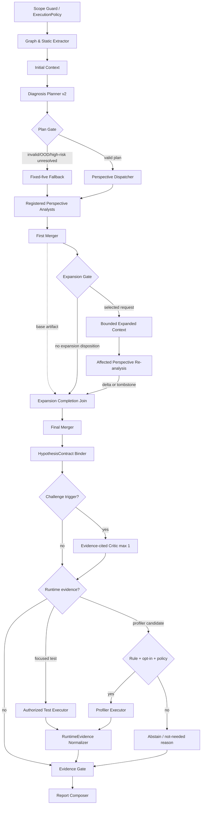

# ADR-04: 증거 게이트가 있는 bounded DAG를 사용한다

- 날짜: 2026-08-23
- 상태: 제안
- 범위: 진단 계획, 제한적 재검색, 실행 검증, 보고서 생성

## 1. 맥락

단일 agent loop는 탐색·진단·실행·보고 책임이 섞인다. 모든 단계를 고정 순서로 실행하면 필요 없는 관점과 도구까지 수행한다. 자유형 swarm은 호출 수와 오류 전파를 통제하기 어렵다.

## 2. 결정

의존 관계와 최대 단계를 명시한 **bounded conditional DAG**를 사용한다.

- 5개 관점은 공통 taxonomy·fixed-five 기준선·fallback으로 유지
- `DiagnosisPlan v2`가 모든 관점의 `run | skip | defer | shadow`, reason, evidence ID, budget을 제안
- Plan Gate가 mandatory route와 fallback을 결정하며 선택 실행은 shadow pilot을 통과한 version만 허용
- graph 확장은 typed request가 있을 때 최대 한 단계
- High/Critical 충돌은 근거 인용형 critic을 조건부 최대 한 번 실행
- test/profiler는 `HypothesisContract`, immutable ExecutionPolicy와 opt-in을 통과할 때 실행
- 모든 노드는 구조화된 계약과 run-level 예산을 소비
- 최종 채택은 fixed-five·single loop·fixed-chain 비교 뒤 확정

조건부 DAG는 프로젝트 설계 가설이다. 최근 연구가 이 정확한 topology의 우월성을 입증했다고 주장하지 않는다.

## 3. 후보 비교

| 후보 | 완전성 | 병렬 | 조건부 실행 | 오류 격리 | 비용 통제 | 추적 | 종합 |
| --- | --- | --- | --- | --- | --- | --- | --- |
| 단일 LLM | -- | -- | 0 | -- | ++ | -- | 기준선 |
| 단일 loop | - | -- | + | - | 0 | 0 | loop 기준선 |
| fixed chain | + | -- | - | + | 0 | ++ | orchestration 기준선 |
| 자유 swarm | 0 | ++ | ++ | 0 | -- | - | 통제 곤란 |
| **bounded DAG + gate** | **++** | **++** | **++** | **++** | **+** | **++** | **제안 구성** |

## 4. 실행 그래프

`PL`은 versioned `DiagnosisPlan v2`를 만들고 Plan Gate는 모든 5관점 disposition, evidence reference, mandatory route, budget, fallback reason을 검증한다. Fixed-five와 shadow arm은 5관점 terminal을 모두 기다리고, 승격된 routed arm은 `run` 관점 terminal과 모든 skip/defer disposition을 기다린다. Planner 실패·schema 오류·OOD·extractor 불완전·unresolved High/Critical은 fixed-five fallback이다. Expansion Completion Join과 lineage merge 규칙은 유지한다. Final Merger 뒤 실행 대상 Finding은 `HypothesisContract`에 결합하고, 조건부 critic은 상태를 승격하지 못하며 반박·우려·probe 요청만 낸다.

## 5. 노드 계약

| 노드 | 입력 | 성공 출력 | 실패 출력 |
| --- | --- | --- | --- |
| Scope Guard | 사용자 범위·승인 | versioned ExecutionPolicy | 차단 사유 |
| Extractor | source snapshot | graph ID, static evidence | parse/unresolved |
| Planner | initial context·budget | versioned DiagnosisPlan v2 | deterministic fallback request |
| Plan Gate | plan·static evidence·promotion version | admitted dispositions·mandatory routes·fallback | fixed-five fallback |
| Perspective Dispatcher | admitted plan | fixed-five/shadow/routed analyst branches | missing disposition |
| Analyst | plan slice·focus lens·budget | contributor Finding[] | abstained |
| Expansion Gate | 전체 실행 관점 request | 선택 request 1개 + 모든 거부 disposition | invalid/lower-priority/budget reason |
| Expansion Completion Join | M1 base, gate disposition, optional D2 terminal | atomic base+delta input | missing branch terminal |
| First/Final Merger | contributors; base + optional delta/tombstone | canonical findings, full history | schema/severity conflict |
| Hypothesis Binder | executable Finding·oracle provenance | versioned HypothesisContract | untestable/inconclusive |
| Semantic Critic | frozen finding·evidence snapshot | disagreement/concern/probe/no-new-evidence | abstained |
| Runtime Router | Finding·HypothesisContract·policy | test/profile/not-needed | blocked |
| Executor | authorized manifest | RuntimeEvidence | failed/inconclusive |
| Evidence Gate | findings·contract·evidence | accepted/rejected/abstained | violations |
| Composer | gated findings | report | missing fields |

## 6. 증거 게이트

### 구조 무결성

- symbol과 source hash가 graph snapshot과 일치
- unresolved를 임의 관계로 바꾸지 않음

### 주장 근거

- claim마다 코드 위치 또는 runtime evidence 존재
- 실행 대상 claim은 versioned HypothesisContract와 연결
- `runtime_confirmed`는 contract에 예측된 관찰과 일치하는 completed/supports RuntimeEvidence 필수
- 요청 범위 밖 일반 조언 제거

### 반례 검토

- 도달 가능한 경로인지 확인
- guard/cache/lock/test 반례 확인
- 해결되지 않은 반례는 confidence 조정이 아니라 `abstained`

### 보고 완전성

- perspectives, root cause, severity, 상태, 근거, 영향, 최소 조치 포함
- 실행 미승인·실패·불안정 상태 보존

## 7. 문맥과 예산

각 관점은 전체 대화 이력이 아니라 목표, graph snapshot, Finding/Hypothesis schema, 자신의 context와 focus lens만 받는다.

모든 비교 가능한 LLM variant는 하나의 inclusive `B_run`을 공유한다.

- input, output, cached token, retry, planner, analyst, critic, gate, composer 모두 포함
- fixed-five 초기 allocation 후보: planner 10%, 관점 합계 50%, merger/gate 20%, composer 20%
- routed arm은 같은 `B_run` 안에서 절감한 관점 budget을 실행 관점·gate에만 재배분
- evaluator-only shadow와 gold adjudication 비용은 운영 `B_run` 밖에 두되 별도 보고하고 system 입력으로 되돌리지 않음
- allocation은 pilot 후보이며 calibration 뒤 동결
- 예산 초과 trial은 실패 또는 non-comparable로 표시
- unconstrained 운영점은 별도로만 보고

## 8. 초기 상한

| 설정 | 초기값 | 성격 |
| --- | ---: | --- |
| 등록 관점 | 5 | taxonomy·fixed-five fallback |
| 초기 실행 mode | fixed-five + planner shadow | routed 승격 전 |
| 조건부 critic | 최대 1회 | pilot 상한 |
| graph expansion | 1회 | hard bound |
| node retry | 1회 | hard bound |
| executor timeout | 120초 | policy default |
| 최종 finding | 20개 | review budget |
| 동일 사례 trial | 3회 | pilot 후보 |

## 9. 위험과 통제

| 위험 | 통제 |
| --- | --- |
| 전달 맥락 손실 | canonical Finding + HypothesisContract + RuntimeEvidence |
| Planner의 중요 관점 누락 | mandatory route, fixed-five fallback, evaluator-owned omission gold |
| 병렬 결과 상충 | contributor 보존 + deterministic merge |
| critic false consensus | 근거 인용 disposition, 상태 승격 금지, 조건부 최대 1회 |
| judge 편향 | deterministic gate + blind calibration |
| 상태 변경 | immutable policy, sandbox, opt-in |
| 추가 계산량 | inclusive B_run과 evaluator shadow 비용 분리 보고 |
| expansion 반복 | typed request 최대 1회 |

## 10. 채택 검증

- 단일 loop 대비 요구사항 누락 50% 감소
- 같은 B_run에서 Critical/High Recall +5%p
- fixed-five 대비 routed arm의 Critical/High·전체 Recall 비열등 한계 `-2%p`, route-attributable Critical/High miss 0건
- analyst call 또는 input/output token 20% 이상 감소
- same-router fixed chain 대비 wall time·tool call 개선
- mandatory-chain 대비 불필요 test/profiler call 30% 감소
- 무근거 발견률 ≤ 5%
- node 실패 시 실행된 독립 관점 결과 보존률 100%

비교 구성과 budget이 같지 않으면 DAG 우월성 주장을 하지 않는다.

## 11. 최신 근거

- [REAP v4, 2026-07-28 revision](https://arxiv.org/abs/2604.01527v4) — production-derived task, 실행 테스트, multi-run stability.
- [SWE-EVO v5, 2026-04-04 revision](https://arxiv.org/abs/2512.18470v5) — 평균 21개 파일의 장기 multi-file task와 부분 진행 평가.
- [HackDetect v1, 2026-07-24](https://arxiv.org/abs/2607.22368v1) — trace exposure·exploit·score inflation 감사.
- [SWE-Router v1, 2026-06-30](https://arxiv.org/html/2607.00053v1) — partial trajectory 기반 routing 가능성과 직접 전이 한계.
- [AgentAbstain v1, 2026-07-11](https://arxiv.org/html/2607.10059v1) — free-form skip 판단의 calibration 한계.
- [Adversarial Review v1, 2026-08-16](https://arxiv.org/html/2608.18167v1) — naive critic의 false consensus와 evidence-constrained disagreement.
- [AI 기술 고도화 심층 조사](../evidence/07-ai-technology-advancement-research.md) — fixed-five/shadow/routed arm과 critic·probe 사전등록 계약.

내부 자막은 2026-08 동향을 찾는 2차 영감 자료로만 보존한다. DAG 성능·생산성의 1차 근거로 사용하지 않는다.

