# AI 진단 파이프라인 기술 설계

- 상태: 2026-08-23 감사 반영, 구현 전
- 범위: Python 3.14 Code Graph, bounded context, 5관점 taxonomy·적응형 planning, 반증 가능한 가설, 승인된 runtime feedback

## 1. 목표와 불변 조건

1. 저장소 구조를 bounded context로 제공한다.
2. 정적 사실·LLM 가설·실행 결과를 분리한다.
3. 모든 명령은 immutable ExecutionPolicy를 통과한다.
4. 최종 Finding은 source와 RuntimeEvidence로 역추적된다.
5. 모든 agent·retry·tool 비용을 포함해 구성 효과를 비교한다.
6. 적응형 관점 선택은 fixed-five shadow와 evaluator-owned gold를 통과한 version에서만 실행한다.

금지:

- LLM이 AST/호출 관계를 원본 사실로 생성
- unresolved 호출을 임의 연결
- 실행 전 성능 가설을 `runtime_confirmed`로 승격
- `null`을 0으로 해석
- profiler 시간을 개선 benchmark로 사용
- 승인·policy 밖 명령 실행
- LLM의 free-form confidence로 관점 skip·도구 실행 결정
- 실행 결과에 맞춰 같은 hypothesis ID의 root cause·oracle 변경

## 2. 전체 bounded DAG

```mermaid
flowchart LR
    I[Scope + ExecutionPolicy] --> G[AST/Symbol/CFG Extractor]
    G --> KG[(Versioned Code Graph)]
    I --> A[Lexical Anchor]
    KG --> A
    A --> C1[Initial Pruned Context]
    C1 --> PL[Diagnosis Planner v2]
    PL --> PG{Plan Gate}
    PG -- invalid/OOD/high-risk unresolved --> F5[Fixed-five Fallback]
    PG -- valid --> DS[Perspective Dispatcher]
    F5 --> D1[Registered Perspective Analysts]
    DS --> D1
    D1 --> M1[First Merger]
    M1 --> EG{Expansion Gate}
    M1 -. base artifact .-> J[Expansion Completion Join]
    EG -- no expansion disposition --> J
    EG -- selected request --> C2[Expanded Context]
    C2 --> D2[Affected Perspective Re-analysis]
    D2 -->|delta or tombstone| J
    J --> M2[Final Merger]
    M2 --> HB[HypothesisContract Binder]
    HB --> Q{Challenge trigger?}
    Q -- yes --> CR[Evidence-cited Critic max 1]
    Q -- no --> E{Runtime evidence?}
    CR --> E
    E -- no --> V[Evidence Gate]
    E -- test --> T[Authorized Test Executor]
    E -- profiler --> R[Deterministic Router]
    R --> O{Opt-in + Policy}
    O -- approved --> P[cProfile / py-spy / Scalene]
    O -- no --> B[Not-needed / Abstain]
    T --> N[RuntimeEvidence Normalizer]
    P --> N
    N --> V
    B --> V
    V --> Z[Report + Trace]
```



Planner는 모든 5관점의 disposition·reason·evidence·budget을 가진 `DiagnosisPlan v2`를 만든다. Plan Gate는 mandatory route와 실행 mode를 검증한다. 실패·schema 오류·OOD·extractor 불완전·unresolved High/Critical은 fixed-five fallback이다. Fixed-five와 shadow는 5관점 terminal을 모두 기다리고, 승격된 routed mode는 `run` terminal과 모든 skip/defer disposition을 기다린다. Final Merger 뒤 실행 대상 Finding은 `HypothesisContract`에 결합한다. 조건부 critic은 반박·우려·probe 요청만 만들며 상태를 승격하지 않는다.

## 3. 단계 0: Scope와 ExecutionPolicy

```yaml
scope:
  scope_id: UUID
  source_commit: sha
  included_paths: []
  excluded_paths: []
  seed_symbols: []
  observations: []
execution_policy:
  schema_version: execution-policy-v1
  execution_policy_id: UUID
  predecessor_execution_policy_id: null
  approved_command_manifest:
    - command_id: CMD-001
      argv: [python, -m, pytest, tests/test_service.py]
      argv_hash: sha256
      cwd: /workspace
      container_image_digest: sha256
  environment_manifest_digest: sha256
  capability_manifest_digest: sha256
  redaction_manifest_hash: sha256
  allowed_tools: [pytest, cprofile]
  environment_allowlist: [PYTHONHASHSEED]
  redacted_environment: [API_TOKEN]
  filesystem:
    read_only_mounts: [/workspace]
    writable_mounts: [/tmp/run-id]
  network: deny
  state_change_class: ephemeral
  reset_required: true
  timeout_seconds: 120
  cpu_limit: 2
  memory_mb: 2048
  profiler_opt_in: false
  allowed_pids: []
  allow_ptrace: false
  approval_id: UUID
```

Executor는 exact argv/cwd/image/environment/capability hash가 policy와 다르면 거부한다. Free-form LLM command를 실행하지 않는다. RuntimeEvidence는 `execution_policy_id`와 hash를 필수로 가진다.
Profiler opt-in 승인 전 policy는 profiler command/PID/ptrace를 허용하지 않는다. 승인되면 Scope Guard가 새 `execution_policy_id`를 발급하고 `predecessor_execution_policy_id`, approval ID, exact command/PID/capability을 묶은 새 immutable policy를 생성한다. Executor와 RuntimeEvidence는 이 새 ID/hash를 사용한다.

## 4. 단계 1: 구조 지식 추출

### AST·심볼

Python 3.14 `ast`에서 module/class/function/method/call/await와 source span을 얻는다. Import alias, 상속, 정적으로 해석 가능한 호출만 연결한다. Reflection, monkey patch, DI는 unresolved reason을 보존한다.

### CFG

함수 단위 basic block:

- branch/early return
- `try/except/finally`
- loop/break/continue
- await 전후
- context manager/resource release

### Version

- node: `symbol_id + source_hash + span`
- graph: extractor version + Python version + repository commit + schema version
- changed file 증분 재색인
- source hash mismatch evidence 자동 무효화

## 5. 단계 2: Retrieval

### Initial context

1. exact file/symbol
2. BM25
3. 자연어 질의에만 vector
4. owner/caller/callee/import/direct test 1-hop
5. ADR-02 tier 순으로 budget 채움

### Typed expansion

```yaml
retrieval_expansion_request:
  request_id: UUID
  producer: performance
  producer_node_id: performance-first-pass
  target_perspective: performance
  reason: unresolved_path | missing_test_link | cross_module_boundary | evidence_gap
  anchor_symbol_ids: []
  allowed_relations: [CALLS, IMPORTS, TESTS]
  max_hops: 2
  remaining_token_budget: 4000
```

Static extractor는 unresolved fact만 structure input으로 전달하고 request를 직접 만들지 않는다. First-pass analyst만 요청할 수 있으며 `producer_node_id=<perspective>-first-pass`, `producer`, `target_perspective`가 모두 일치해야 한다. 모든 first-pass 완료 뒤 ADR-02 stable arbitration으로 하나를 고르고 target perspective만 재분석한다.

### Compact serialization

```text
[FUNCTION] app.service.fetch_user app/service.py:20-44
  CALLS -> [METHOD] repo.UserRepo.get app/repo.py:15-27
    TESTED_BY <- [TEST] tests.test_service.test_fetch_user
```

## 6. Run-level budget

Evidence context 상한:

$$
B_{evidence}=\min(24{,}000,\lfloor0.25C_{model}\rfloor)
$$

이는 전체 `B_run` 안의 초기 후보값이다.

- `B_run`은 planner, analyst, retry, critic, gate, composer의 input/output/cached token을 모두 포함
- fixed-five 초기 allocation 후보: 10/50/20/20%
- routed mode는 절감한 관점 budget을 실행 관점·gate에만 재배분
- evaluator-only shadow·gold adjudication은 운영 `B_run` 밖에 두되 비용을 별도 보고하고 system 입력으로 되돌리지 않음
- calibration 뒤 동결
- 초과 trial은 `non_comparable`
- token 절감 claim은 같은 `B_run`에서만 허용

## 7. 단계 3: DiagnosisPlan v2와 등록 관점 분석

```yaml
diagnosis_plan:
  schema_version: diagnosis-plan-v2
  plan_id: UUID
  source_commit: sha
  graph_hash: sha256
  planner_model_hash: sha256
  budget_version: B-run-v1
  mode: fixed_five | shadow | routed
  perspectives:
    - perspective_id: concurrency
      disposition: run | skip | defer | shadow
      source: deterministic_mandatory | planner_proposed | fallback
      reason_code: async_shared_state
      trigger_evidence_ids: [E-GRAPH-21]
      focus_lens_ids: [resource-lifecycle]
      allocated_tokens: 4000
      stop_condition: evidence_gap_closed
  fallback_reason: null | schema_invalid | ood | extractor_incomplete | unresolved_high_risk | budget_invalid
```

Plan Gate 불변 조건:

- 구조·정확성·성능·동시성·테스트 모든 관점에 disposition과 reason 존재
- evidence ID가 graph/context snapshot에 존재
- LLM이 deterministic mandatory route를 제거하지 못함
- final holdout 전 taxonomy, trigger, model, budget, promotion version 동결
- fixed-five shadow 출력은 gold가 아니며 evaluator-owned defect·필요 관점 multi-label만 omission gold로 사용

| 관점 | 질문 | 실행 요청 조건 |
| --- | --- | --- |
| 구조 | 책임·경계·순환 문제인가? | 일반적으로 없음 |
| 정확성 | 예외·상태 경로가 틀렸는가? | 재현 가능한 실패 |
| 성능 | 비용이 호출/입력에 따라 커지는가? | 우선순위를 바꿀 가설 |
| 동시성 | blocking/race/deadlock 가능성인가? | concurrent test/trace |
| 테스트 | 중요 경로가 방어되는가? | 기존 test로 확인 가능 |

등록 focus lens는 `change-impact`, `resource-lifecycle`, `data-transaction-contract`, 범위 승인 시 `security-boundary`다. 미등록 요구는 parent 관점의 `supplemental_focus`로 shadow 기록하고 offline taxonomy 검토 전에는 별도 specialist로 실행하지 않는다.

각 raw finding은 contributor ID를 가지며 canonical merge 후에도 삭제하지 않는다.

## 8. 단계 4: Finding 병합

ADR-01 `finding-v2` 계약을 사용한다.

정규화 키:

```text
root_cause_category
+ primary_location.symbol_id
+ overlap(intersection/min_span >= 0.5)
```

- 같은 원인은 contributor perspectives와 severity evidence를 배열로 보존
- 다른 원인은 같은 위치여도 분리
- 분류 불가 원인은 `unclassified`로 두고 자동 병합하지 않음
- Contributor는 immutable `contributor_lineage_id`, candidate-matching fingerprint, revision, supersedes ID, disposition을 가진다.
- D2는 재검토 대상 M1 contributor slice(lineage ID, contributor ID, fingerprint, revision, disposition, finding association)를 입력받고 각 lineage마다 successor 또는 retraction을 내보낸다.
- M2는 base canonical set에 delta/tombstone을 lineage ID로 적용한다. Revision이 증가하지 않거나 supersedes link가 slice와 다르면 delta를 거부한다. 최신 revision만 canonical 계산에 사용하고 history와 재분석하지 않은 관점을 보존한다.
- 자유 `confidence` 필드는 사용하지 않음

상태:

```text
hypothesis
  -> statically_supported
  -> runtime_confirmed
  -> rejected
  -> abstained
```

## 9. 단계 5: HypothesisContract, Runtime request와 router

### HypothesisContract

```yaml
hypothesis_contract:
  schema_version: hypothesis-v1
  hypothesis_id: UUID
  finding_id: F-0001
  claim_quantifier: universal | existential | probabilistic | normative
  root_cause_category: sync_io_in_async
  primary_location: package.module:Class.method
  preconditions: []
  action: "동시 요청 N개 실행"
  predicted_observations:
    supports: []
    refutes: []
  oracle:
    kind: user_observation | doc_contract | evaluator_spec | existing_test | benchmark
    evidence_id: E-ORACLE-01
  workload_hash: sha256 | null
  execution_policy_id: UUID
```

- universal 주장은 하나의 유효 counterexample로 반박할 수 있다.
- existential·race·확률적 주장은 probe 미재현으로 반박하지 않는다.
- independent oracle이 없으면 실행 결과는 `inconclusive` 또는 사람 검토용 artifact다.
- claim, root cause, 위치, precondition, oracle을 바꾸면 새 hypothesis ID를 발급한다.

### Focused test

```yaml
test_execution_request:
  request_id: UUID
  finding_id: F-0001
  hypothesis_contract_id: H-0001
  execution_policy_id: UUID
  command_id: CMD-001
  expected_state_change_class: ephemeral
```

Executor는 command manifest exact match, contract ID, reset, timeout, capability를 확인한다. Router는 lifecycle 전 모든 deduplicated High/Critical Finding에 `runtime_eligibility.state`, enumerated reason code, verification kind를 기록하고 run/report artifact에 보존한다. Opt-in decline은 eligibility를 변경하지 않는다.

### Profiler

ADR-03 결정론적 rule을 그대로 적용한다.

1. unsafe/policy mismatch → blocked
2. explicit request + eligible → opt-in
3. observed regression + eligible → opt-in
4. Critical/High + static signal 2개 + eligible → opt-in
5. 그 외 not-needed

학습 router는 paired blind utility label과 power analysis 뒤 별도 version으로만 도입한다.

### Lifecycle mapping

`Finding.verification.request_status`, `run_status`, `result`는 ADR-01/ADR-03과 동일한 enum을 사용한다. 별도 `verification.status` 축약 필드는 만들지 않는다. `reason_code`는 applicable terminal state에서 필수다.

| request_status / run_status / result | Finding.status |
| --- | --- |
| `approved / completed / supports` | `runtime_confirmed` |
| `approved / completed / refutes` | `rejected` |
| `not_considered / not_started / not_applicable` + `reason_code=static_counterevidence` + valid counterevidence ID | `rejected` |
| `not_needed / not_started / not_applicable` | 기존 정적 상태 |
| `declined / not_started / not_applicable` | `abstained` |
| `candidate / blocked / not_applicable` | `abstained` |
| `approved / blocked·failed·inconclusive / not_applicable` | `abstained` |

`completed/refutes`는 연결된 hypothesis를 `rejected`로 만든다. LLM이 같은 ID에서 root cause를 바꿔 반박을 회피할 수 없다. 새 설명은 새 Finding/Hypothesis로 시작하며 이전 RuntimeEvidence를 지지 증거로 상속하지 않는다.

## 10. RuntimeEvidence와 profiler 정규화

```yaml
runtime_evidence:
  schema_version: runtime-evidence-v1
  evidence_id: E-PROFILE-0001
  evidence_kind: profile | test
  case_id: PERF-001
  run_id: UUID
  execution_policy_id: UUID
  source_commit: sha
  source_hash: sha256
  graph_hash: sha256
  command_hash: sha256
  workload_hash: sha256
  environment_hash: sha256
  execution_policy_hash: sha256
  tool: py-spy
  tool_version: 0.4.2
  outcome: completed
  raw_uri: evidence://...
  raw_sha256: sha256
  redaction_manifest_hash: sha256
```

Adapter:

- cProfile 3.14: calls/tottime/cumtime/caller/callee
- py-spy 0.4.2: stack sample, thread/process, optional native
- Scalene 2.3.0: Python/native/system, memory/copy/call graph

`HotspotRow`는 `evidence_id`를 참조한다. 지원하지 않는 값은 `null`이다.

CPU 누적 80%, 항목 5%, 최대 20행, 3회, CV 20%는 pilot 후보이며 검증된 threshold가 아니다. CV 자원 축을 기록하고 calibration에서 고정한다.

## 11. Evidence Gate

### 결정론적 검사

- location/source hash가 snapshot과 일치
- evidence ID와 RuntimeEvidence envelope 존재
- 실행 대상 Finding이 versioned HypothesisContract와 연결
- runtime outcome이 contract의 support/refute observation·oracle과 일치
- runtime_confirmed가 completed/supports와 raw hash 참조
- severity가 ADR-01 rubric v1과 판정 이유를 가짐
- profiler 미지원 필드를 주장하지 않음

### 반대 검토

- 경로 도달 가능성
- guard/cache/lock/test 반례
- hotspot이 root cause인지 상위 caller 결과인지
- workload 대표성
- 더 단순한 설명

불충족은 `rejected` 또는 `abstained`다. 점수만 낮춰 최종 본문에 남기지 않는다.

## 12. 최종 보고

```markdown
## [High][runtime_confirmed] async 경로의 동기 I/O
- 관점: performance, concurrency
- 위치: `app/service.py:20-44`
- 원인: `sync_io_in_async`
- 정적 근거: `E-GRAPH-21`
- 실행 근거: `E-PROFILE-2` (`runtime-evidence-v1`)
- 영향: 동시 요청 시 응답 지연
- 한계: workload 대표성 제한
- 조치: async 경계 수정 후 별도 benchmark
```

## 13. 최적화와 실패 처리

| 조절값 | 품질 | 비용 | 비고 |
| --- | --- | --- | --- |
| graph tier/hop | evidence Recall | tokens | project calibration |
| node cap | localization | tokens | project calibration |
| perspective disposition | omission Recall | LLM calls | fixed-five/shadow/routed same B_run |
| focus lens | residual Recall | tokens·duplicate | registry promotion |
| semantic critic | counterevidence | critic tokens | gate/self-review comparator |
| profiler policy | performance Recall | profiler sec | P3/P4-F5 |
| evidence gate | grounding | judge cost | P4-F5/P4-NG |
| retry | consistency | tokens | max 1 |

실패:

- parser 일부 실패 → unresolved + lexical source
- graph path 없음 → evidence gap
- schema 위반 → retry 1회 후 node failure
- plan schema/OOD/high-risk unresolved → fixed-five fallback
- routed terminal 누락 → run 실패, fixed-five 결과로 조용히 대체 금지
- hypothesis/oracle 변경 → 새 ID; 기존 confirmation 상속 금지
- policy mismatch → blocked, 자동 권한 상승 금지
- environment failure → 결함 확인으로 사용 금지
- profile instability → inconclusive/abstained
- budget 초과 → non-comparable

## 14. 구현 완료 판정

- ExecutionPolicy exact-match 거부 경로 작동
- initial + optional expansion DAG 작동
- DiagnosisPlan v2가 5관점 disposition·evidence·budget·fallback을 보존
- fixed-five와 planner shadow가 동일 Finding 결과를 내고 shadow 출력이 gold로 유입되지 않음
- canonical Finding merge가 contributor를 보존
- executable Finding→HypothesisContract→test/profile raw→RuntimeEvidence→HotspotRow 재현
- refutes 결과의 같은 hypothesis ID 재해석 차단
- 모든 lifecycle terminal이 report/KPI에 매핑
- same-B_run B2~P4-F5/S1/S2/C1/C2 실행 가능
- final holdout artifact 접근 차단

## 15. 관련 ADR

- [`../ai-selection-matrix/01-multi-perspective-diagnosis-adr.md`](../ai-selection-matrix/01-multi-perspective-diagnosis-adr.md)
- [`../ai-selection-matrix/02-code-context-retrieval-adr.md`](../ai-selection-matrix/02-code-context-retrieval-adr.md)
- [`../ai-selection-matrix/03-profiler-in-the-loop-adr.md`](../ai-selection-matrix/03-profiler-in-the-loop-adr.md)
- [`../ai-selection-matrix/04-agent-orchestration-adr.md`](../ai-selection-matrix/04-agent-orchestration-adr.md)
- [`07-ai-technology-advancement-research.md`](07-ai-technology-advancement-research.md)

