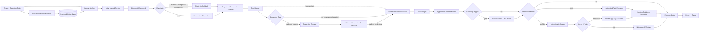

# AI 진단 파이프라인 기술 설계

- 상태: 부분 구현·Python 3.12.4/3.14.3 오프라인 148개 회귀 및 개발용 Docker/Python 3.14.7 기본 동작 확인, 대상 저장소 승인형 실행·최종 실증 미검증
- 범위: Python 3.14 Code Graph, bounded context, 5관점 taxonomy·적응형 planning, 반증 가능한 가설, 승인된 runtime feedback

**실행 증거(개발 환경 Python 3.12.4):** `python3 -m unittest discover -s tests -q`에서 124개 통과. 임시 Git 저장소의 `diagnose_approved.py --scope full --final-output`에서 Python 모듈 2개의 다섯 관점 기록과 미분석 경로 2개를 확인했다. 이 기본 동작 확인에는 **테스트 전용으로 발급한 영수증과 토큰 1개 상한**을 사용했으며 모델 연결은 금지했다. 실제 `seal_report.py --run-manifest` CLI로 같은 다중 모듈 검토를 다시 봉인했다. 별도 오프라인 시험에서 실패한 Docker 실행을 **합성한 로그**를 `seal_report.py --runtime-trace-dir`에 전달해 실행 흔적이 연결된 보고서를 확인했다. `record_final_action.py`는 해당 보고서에서 실행 흔적 경로가 없거나 소유자 대화형 확인이 없으면 조치를 거절했다. 실제 Docker 실행·소유자 승인·모델 API 응답·독립 판정의 증거가 아니며 보고서의 확증 건수는 0이다. 이전 출처 스캔 → 검토 → 보고서 → 실제 단말 조치 봉인 시나리오도 확인했으며 이전 보고서 바이트는 보존됐다.

**Python 3.14 별도 확인:** `uv python install 3.14`로 받은 CPython 3.14.3에서 `uv run --no-project --python 3.14 --with fastapi==0.135.1 --with httpx==0.28.1 python -m unittest discover -s tests -q` 실행 결과 124개 통과(건너뛰기 없음). 실제 3.14 CLI `diagnose_approved.py --scope full --final-output`도 두 모듈을 처리해 출처 전용 보고서(확증 0건)를 생성했다. 테스트 전용 영수증의 토큰 한도를 1개로 묶어 모델 전송은 일어나지 않았다. 이 실행에는 일곱 개발 사례의 행동 oracle도 포함되지만 Docker/Python 3.14 고정 이미지·공개 저장소 런타임 파일럿 결과는 포함되지 않는다.

**구현·설계 구분:** 정적 Git 원본·그래프 문맥, Git Python 모듈 전체/후보 영향 범위의 승인형 5관점 호출·공유 예산·미분석 표기, 단일 사용 승인 경계, 출처 전용 5종 레코드, Git 추적 파일에 한정한 focused pytest·unittest·coverage 및 조건부 cProfile 격리 실행 코드, 해시 재검증 가능한 **미인증 실행 흔적** 연결, 독립 평가자의 봉인된 80사례 6개 군 입력 검증기는 구현됐다. 소유자 승인 개발용 코드의 두 모델 실제 호출 결과는 아래에 분리했다. 대상 저장소의 승인형 Docker 실행·실행 증거의 독립 oracle 판정·실행 후 최종 Finding 승격·공개 파일럿/최종 정량 결과·적응형 관점 선택 및 설계도에 있는 critic/확장 반복은 수행되거나 구현됐다고 주장하지 않는다. 본문의 DAG는 목표 설계이며 개발 파일럿으로 입증된 범위가 아니다.

**v27 가정·경계조건 추가 역할 구현:** `diagnose_approved.py`와 `check_code.py`의 `--boundary-review`는 기존 다섯 역할 뒤에 `assumptions`를 추가한다. 별도 프롬프트 해시로 새 승인을 요구하며 기본 다섯 관점의 해시는 유지했다. 새 역할의 분류는 기존 다섯 taxonomy 중 하나이고, 역할별 출처·상태·비용은 여섯 감사 행으로 봉인한다. 모든 모듈·역할이 같은 예산을 공유한다. 이 개발 경로는 최종 F·80사례·두 shadow 실험의 변경이나 승격이 아니다([사용법](../../src/modules/diagnosis/USAGE.md#선택-추가-역할-가정경계조건-검토)).

**추가 역할의 실제 CLI 확인(합성 응답):** 임시 Git 저장소와 로컬 HTTP 시험 서버로 `check_code.py --boundary-review`를 별도 프로세스·시험용 대화형 승인에서 실행했다. 정상 시 역할 6개 완료·합성 사용량 총 720토큰·후보 2개·확증 0개·종료 0. 추가 역할만 문맥 밖 999줄을 지목한 경우 기존 다섯 역할은 완료·추가 역할은 `candidate_location_outside_context` 실패·기존 후보 1개 유지·확증 0개·종료 3이었다. 두 경우 모두 응답 6개와 일회용 영수증 소진, 봉인 재검증, Markdown의 추가 역할 상태·120토큰 표시를 확인했다. 서버는 종료하고 임시 자료는 제거했다. **사용량과 후보는 시험 서버가 만든 값**이며 외부 모델 호출·대상 코드 실행·품질 실측은 없다.

**추가 역할 회귀:** `python3 -m unittest discover -s tests -q`에서 176개 통과. `uv run --no-project --python 3.14 python -m unittest discover -s tests -q`에서 176개 중 175개 통과·1개 건너뜀(FastAPI/httpx 개발 fixture 의존성 미설치). 새 회귀는 역할과 taxonomy 분리·추가 역할 실패 격리·잘못된 모드 승인의 영수증 보존·여섯째 예산 보류·남은 모듈의 미완료·감사 역할 누락/위조 거절을 확인한다. 기존 기본 모드도 전체 회귀에 포함된다.

**이번 준비 확인:** 테스트 전용 영수증·모델 응답을 사용한 실제 `diagnose_approved.py --symbol a --final-output` CLI가 `selected_symbol_only`를 봉인하고, `seal_report.py --run-manifest` 재봉인도 동일한 범위를 유지했다. Git 그래프 문맥의 노드 목록을 바꾸거나 반환된 소스 조각 밖 줄을 Finding에 넣으면 재봉인을 거절했다. 선택한 심볼만 24 KiB 문맥 한도에서 빠지고 이웃 노드만 남는 경우는 영수증 소비 전에 거절했다. 모델 응답은 시험 대체값이며 실제 외부 모델 진단 성과가 아니다.

**문맥 밖 임시 가설 차단:** 시험용 Git 파일에서 요청한 함수 밖의 시작 줄과 함수 안에서 밖으로 넘는 끝 줄을 모델 응답으로 제시했을 때, 변경 전 `--symbol` 임시 결과에는 다른 함수의 가설 1개가 잘못 남았다. 수정 후 동일 CLI에서 해당 관점을 `failed`로 기록하고 두 후보를 모두 제외했으며, 반환 소스 조각 안의 유효한 후보 1개만 임시 결과와 출처 전용 보고서에 `deferred`로 남겼다. 직접 실행한 CLI 기본 동작 확인에서도 문맥 밖 가설이 임시 결과·봉인 보고서에 모두 0건임을 확인했다. 이 검사는 모델이 주장한 결함의 실제 존재나 runtime 확인을 입증하지 않는다.

**합성 개발 사례(최종 평가에서 제외):** `python3 src/build_dev_fixture.py /private/dev-case --mutation correctness`로 별도 Git commit을 만들고 반환된 `oracle_argv`를 해당 저장소에서 실행한다. `clean`, `correctness`, `performance`, `concurrency`, `cancellation`, `api_contract`, `cross_file` 일곱 사례를 Python 3.12.4와 설치된 FastAPI 0.135.1/httpx 0.28.1에서 실행했다. 정상 사례는 6개 행동 판정 통과, 변이 6종은 각각 해당 판정 1개 실패. 별도 Python 3.14.3 회귀에서도 일곱 개발 사례가 통과했다. 이는 공개된 개발 사례이며 숨긴 정답이나 Docker 파일럿 결과로 사용할 수 없다.

**로컬 OAuth 최초 준비(2026-09-26, 로그인 전):** Node v24.13.0에서 저장소 밖 `/tmp/wreckfish-openai-oauth-2.0.0`에 `openai-oauth@2.0.0`을 `--ignore-scripts`로 설치했다(`added 31 packages`). 당시 `~/.codex/auth.json`이 없어 기동에 실패했다. `RunManifest`의 최초 `/v1/chat/completions` 전송은 임시 HTTP 서버에서만 확인했고, Python 3.12.4/3.14.3 전체 회귀 각 **136개 통과**를 기록했다. 이 시점에 실제 모델 응답이나 청구 결과는 없었다.

**일회성 실제 전송 경로 확인:** 승인 대상 소스 대신 `ping`을 보낸 임시 127.0.0.1 HTTP 서버 호출에서 `/v1/chat/completions`의 `gpt-6-luna` 요청을 관측했다. 응답 `prompt=11`(캐시 4 포함)·`completion=3`을 `input=7`, `cache=4`, `output=3`으로 정규화했고 `candidates=[]`, `stop_reason=end_turn`이었다. 이 서버는 실제 OAuth 프록시나 실제 모델이 아니다.

**본인 로그인 후 실제 모델 연결 확인(2026-09-26):** 프록시를 `127.0.0.1:10531`에서 시작해 강제 모델 목록 없이 `/v1/models`에서 `gpt-6-sol`·`gpt-6-luna`를 확인했다. 양쪽 `/v1/chat/completions`는 500 `Bad Request`였고, `/v1/responses`는 성공했다. 승인형 클라이언트를 **Responses 주소로 교체**해 소스가 없는 같은 `{\"ready\":true}` 요청을 다시 보낸 결과, 강한 모델과 작은 모델이 각각 같은 JSON을 반환했다. 강한 모델: 입력 31·캐시 0·출력 9토큰, 1.534초. 작은 모델: 입력 31·캐시 0·출력 9토큰, 1.459초. 1회씩의 무해한 연결 확인으로 진단 정확도·속도 우열·실제 USD 청구액을 판단할 수 없다.

**코드 비교 준비(전송 전 상태):** `build_dev_fixture.py --mutation correctness`로 만든 개발 전용 Git 사례 SHA `630f777997abf640c8e41981259d49b70935ae4c`에서 `oracle.py`를 **새 저장소 복사본에서만** 제거해 모델에 정답이 노출되지 않는 SHA `e2028838757f1df99a23f8b4aa51b0e73711c87d`를 봉인했다. `page` 문맥은 서비스·도우미 노드 8개/2,461바이트이고 `oracle.py` 노드가 없다. 강한 1회·작은 5관점 각각 동일 SHA·프롬프트 해시·모델 전용(`tools=[]`, `nodes=[]`) 승인 입력을 저장소 밖에 만들었다([진행 티켓](../../.wayfinder/ai-a-plus-code-health/tickets/029.md)). 당시 소유자의 대화형 영수증 승인이 없어 코드 전송을 하지 않았고 승인 없는 실제 CLI는 거절됐다. Python 3.12.4/3.14.3 전체 회귀 각각 **139개 통과**. 단일 개발 심볼 출력은 최종 봉인 보고서가 아니다.

**원본 무결성·사전 거절 보강(최종 실증 아님):** 임시 Git commit의 원본 Python blob에 `refs/replace`로 다른 내용을 붙이면 변경 전에는 스캔과 출처 재검사가 바뀐 내용을 원본으로 수락했다. 변경 후 `scan_sources.py --clean-replay --symbol consumer` 실제 CLI에서 재검사 `match`·선택 문맥을 확인했고, 교체된 Git 객체가 있어도 출처 재검사는 원본 blob SHA를 확인했다. `pkg/__init__.py`만 바꾼 별도 후보에서 `plan_scan.py ... candidate ... --scope impact`가 `import pkg.child`를 사용하는 `app.py`를 선택했다. 변경 전에는 해당 경로가 생략됐다. 스캔·출처 봉인에 표현할 수 없는 비UTF-8 Git Python 파일명은 전체 스캔을 오류 코드 2와 명시적 사유로 거절한다. 이것은 해당 파일을 분석했다는 증거가 아니다.

**승인 경계·전체 범위 기준선 보강(시험용 자료):** 진단 CLI는 부적합 프롬프트/주소/전송 항목, 출처 묶음 내부 영수증·실행 출력, Git에 없는 실행 대상 파일을 영수증 소진 전에 거절한다. 임시 자체 생성 Git 사례와 **시험용 영수증**에서 미지원 모델 주소의 실제 `diagnose_approved.py` 명령은 종료 코드 2, 영수증 미소진이었다. `--scope full --single-baseline`은 파싱 가능한 전체 Git Python 모듈 원문을 검색 간선 없이 강한 모델 한 번에 입력하는 개발 경로다. 임시 두 모듈의 시험용 응답을 사용한 실제 CLI에서 임시 결과 `stage=pilot_baseline_provisional`·범위 `full_tracked_python_git_commit`·호출 기록 1개를 확인했다. 부분 파싱 소스는 승인 전에 거절한다. Python 3.12.4/3.14.3 전체 회귀 각각 **148개 통과**. 대상 코드 실행, 외부 모델 소스 전송, 소유자 승인, 독립 결함 확증, 80사례·USD 청구 실측은 이 확인에 포함되지 않는다.

**소유자 승인 후 실제 두 모델 호출(개발 사례, 최종 비교 아님):** 같은 Git SHA `e2028838757f1df99a23f8b4aa51b0e73711c87d`의 `--symbol page`에 대해 소유자가 각각 직접 해시를 입력한 두 RunManifest를 원본 Git·모델·프롬프트 해시와 대조한 뒤 일회용 영수증을 소비했다. 루프백 OAuth 프록시를 사용하고 호출 후 종료했다. 출력은 소유자 전용 디렉터리의 `strong-result.json`(SHA-256 `882b386bf4bb3efc38019a598a9d1c1d54bf7d931fdd1161f5bb30f6ab708920`)·`small-result.json`(SHA-256 `6071907cbea84150615be528c8c3cf467c5165cfec5939ceb02da85fa9b5b82a`)에 보관했다. 파일에는 감사 상태·정규화된 요청/응답 해시가 있지만 제공자 원문·청구 영수증은 없다.

| 개발용 호출 | 관측된 호출 상태 | 반환된 임시 발견 | 모델 사용량·호출 벽시계 합계 |
| --- | --- | --- | --- |
| `gpt-6-sol` 강한 단일 호출 | `failed`, `ValueError` (세부 원인은 저장된 출력만으로 식별 불가) | 유효한 결과 없음; 0개 발견으로 해석 금지 | 2,943토큰 · 6.898초 |
| `gpt-6-luna` 정적 5관점 | 다섯 관점 모두 `completed` | 0개 후보 | 13,213토큰 · 8.370초 |

이 개발 사례는 `service.py:12`의 `return items[offset:offset + count + 1]` 변이를 포함한다. [기존 개발용 행동 oracle](../../fixtures/development/oracle.py)은 1개를 요청한 `page([11,22,33],1,1)`에 `[22]`를 요구했고, 앞선 개발 회귀에서 해당 변이가 이 판정에 실패했다. 이번 승인은 **모델 전용**이므로 현재 복사본에서 대상 코드를 다시 실행하지 않았다. 작은 모델의 빈 후보는 알려진 개발 변이의 탐지 실패 사례이나, 강한 모델의 응답도 실패했으므로 발견률 우열을 계산할 수 없다. 이 2,461바이트는 전체 저장소 범위가 아니고, 토큰은 USD 청구 금액이 아니다. 독립 봉인 최종 80사례·격리 실행 피드백·제공자 원본 청구 증거가 없어 A+ 성과에 합산하지 않는다.

**개발 연결 경로·사용자 결과(최종 실증 아님):** `python3 src/check_code.py REPOSITORY --manifest SAVED_MANIFEST.json --output NEW_OUTPUT_DIR [--revision HEAD] [--symbol SYMBOL]`은 새 Git SHA와 현재 프롬프트 해시를 복사 설정에 반영한다. 소유자가 전체 설정과 SHA-256을 단말에서 직접 확인해 한 번 입력해야 한다. 설정에 `nodes`가 있으면 CPU·메모리·PID 강제 가능 호스트와 `log`·`evidence` 전송 권한을 승인 전 검사하고, 승인된 기존 workload를 **먼저** 실행한다. 출처·manifest·로그를 검증한 후 최대 8,192바이트 발췌를 다섯 관점 입력에 넣는다. 종료 코드 0은 관점 모두 완료·실행 node 실패/보류 없음, 3은 분석 또는 실행 일부 실패/보류, 2는 입력·승인·무결성 거절이다. 관측된 명령 실패는 원인 가설과 별도 표시하고 Finding은 여전히 `deferred`, 확증 0건이다. 새 프롬프트 SHA-256은 `5402e3628a4c6256a2cfc632b97dc52ea32b467e2534e198ba28662718b2accb`; 앞의 실제 두 영수증은 소비됐고 이전 출력은 재분류하지 않는다.

**실행 확인의 범위:** `python3 -m unittest discover -s tests -q`에서 160개 통과. 실제 `scan_sources.py` subprocess, 진단·봉인·Markdown 생성 코드를 통과하는 임시 Git 저장소에서 **시험 전용 승인·공급자 응답만 대체**해 `check_code.py`의 출력 리포트를 직접 열었다. 요약에는 관점 완료 5·후보 0·확증 0·`실행하지 않음`·요청/응답 해시·토큰이 표시됐다. 비대화형 실제 CLI subprocess는 종료 코드 2, 출력 디렉터리 생성·모델 전송·실행 0건이었다. 별도 검증된 **시험용 실패 trace**는 모델 입력과 리포트에 argv·exit 1·stderr를 유지했고, 로그 1바이트 변경은 검증이 거절됐다. 실제 Docker 대상 실행이나 신규 외부 모델 호출은 없었다.

**후속 정적 탐색과 프롬프트 버전:** `5402e3628a4c6256a2cfc632b97dc52ea32b467e2534e198ba28662718b2accb`는 당시 개발 실증의 구조화 프롬프트 해시였고, 정적 반례 지시를 추가한 `70996a3f6f4ad95f9631b0383dfbebf48db60602e2c21bd059a0a581b7afe116`은 첫 Starlette 공개 개발 호출에 사용됐다. 접수 규칙과 불일치를 발견해 바꾼 **당시 v27 해시** `9df13fbb8997b310bc18f09d0672ccae2380a052d9897ee3c6d7f8ce823f48a7`로 소유자 승인 네 진단을 수행했다. 수정 전 공개 EOF 가설은 강한 모델에서 정확한 위치로 접수됐지만 작은 모델에서는 위치 오류·한 관점 실패가 남았다. v29의 모드별 역할 지침 해시는 [P1 로컬 증적](04-public-as-is-to-be-comparison.md#v29-p1-역할별-지침과-승인-경계-구현)과 분리하며 실모델에 적용하지 않았다. 모델 성능 향상의 인과와 최종 우월성은 미입증이다([재실측](04-public-as-is-to-be-comparison.md#수정된-프롬프트-소유자-승인-후-네-건-실제-진단)).

**후속 승인 응답 원자료 보관(개발 경로):** `check_code.py`는 승인된 진단 결과 아래 `responses/`를 만들고, 정규화된 응답 JSON을 **후보 해석·접수 전에** 소유자 전용 파일(디렉터리 0700, 파일 0600)로 기록한다. 실제 파일 SHA를 호출 감사의 `response_sha256`와 대조한다. v28에서는 직접 `diagnose_approved.py`에도 `--response-output DIR`이 필수이며 생략은 승인 소비 전에 거절한다. 전체 응답 파일은 외부에 두고 후보 행은 감사에 봉인한다. HTTP 원시 바이트·제공자 신원·결함 진실까지 증명하지 않는다. [P0 실제 CLI 및 과거 응답 재생](04-public-as-is-to-be-comparison.md#v28-p0-승인후보-접수-수정과-오프라인-재생)은 신규 모델 호출 없이 접수 손실 수정을 검증한 자료다.

**다음 실증:** 이 선언형 workload 선실행은 개발 연결 경로이며 최종 `가설 → 검증 선택 → 실행 피드백 → 독립 근거 판정` DAG가 아니다. 현 WSL cgroup 제한 부재, 대상 의존성이 설치된 고정 이미지 digest 부재, 이 실행에 대한 신규 소유자 승인 때문에 일곱 개발 사례를 새 CLI로 실행한 정확도 관문은 아직 통과하지 못했다. 강한 단일 모델 대 작은 시스템의 동일 사례 비용·결함 단위 비교, 80개 독립 최종 사례와 동일 작은 모델 6군 기여 검증도 필수로 남는다. 이번 테스트 토큰 수·화면 개선을 비용 절감이나 A+ 성과로 세지 않는다.

**후속 v26 개발 실행 결정(기존 관측의 재분류 아님):** 소유자가 자원 제한을 요구하지 않는 개발용 Docker 실행을 허용했다. 현재 `validate_runtime_host()`는 daemon 연결을 확인하며 cgroup 한도 미지원 시 경고하고 진행한다. 신뢰한 고정 Python 이미지의 네트워크 차단·읽기 전용 Docker 명령과 새 호스트 확인 경로를 실제 실행했고, 변경 직후 회귀 158개 통과. **이 시점에는** Prefect 대상 코드와 대상별 RunManifest를 아직 실행·승인하지 않았다. 후속 좁은 Prefect 실제 실행은 아래 절의 별도 결과다. 최종 평가에는 자원 강제 호스트와 독립 정답·청구 증거가 필요하다([개발 비교](04-public-as-is-to-be-comparison.md)).

**후속 소유자 승인 Docker 실제 실행:** 위 v26 준비 뒤 소유자가 Prefect 공개 실제 결함의 원본 `math.py` 수정 전·후를 각자 정확한 RunManifest 해시로 승인했다. `run_approved.py`를 두 번 실제 실행해 수정 전 `ZeroDivisionError`/종료 1, 수정 후 같은 행동 검사 성공/종료 0을 관찰했고, `--verify`로 두 실행 원본을 재대조했다. 이는 전체 Prefect 실행이나 AI 진단 우월성이 아니다. 사용한 이미지·원본 blob SHA·로그·상세 범위는 [공개 사례 실측](04-public-as-is-to-be-comparison.md)에 기록했다. 해당 두 영수증은 소진됐고 추가 모델 소스 전송에는 새 소유자 승인이 필요하다.

**고정 공개 저장소 정적 파일럿(실행 검증 아님):** 각 태그를 저장소 밖 임시 디렉터리에 얕게 복제하고 HEAD를 아래 커밋과 대조한 뒤 `python3 src/scan_sources.py REPO COMMIT OUTPUT`으로 불변 Git Python 파일의 출처 기록만 생성했다. 임시 디렉터리는 삭제됐다.

| 저장소 / 태그 | 확인한 커밋 | Python 출처 기록 | 출처 실행 ID | 관찰 |
| --- | --- | ---: | --- | --- |
| fastapi-users/fastapi-users v15.0.5 | `9ef8cd82619856772ac06a178b114eb47c79586c` | 88 | `a6e7655873f2a9d8dacd94892f2e1fe5bf1b0d721cae90712b02b5f36001451b` | `source_scanned` |
| PrefectHQ/prefect 3.8.4 | `57ee2c2c10f662fee32807c126a117adce32dd28` | 1,901 | `bd551c1cd9c4be842c8859b0cf05845f1407849de8d951f5cc545aa9768f68ed` | `source_scanned` (스캔 약 10.237초; 대상 코드의 이스케이프 `SyntaxWarning` 2줄) |
| langflow-ai/langflow v1.11.5 | `ab52f7f8b911bb42712cefdfe9af3ed02db560a6` | 3,594 | `cbb22c98ed0248720ff7dd9cf43b01ee8349efa08d5bea5c061a81e785d9bf75` | `source_scanned` (스캔 약 12.874초) |

**추가 선택·오프라인 확인(Python 3.14.3):** 의무 런타임 후보 중 MIT 라이선스와 작은 인증 API·교차 파일 경계를 가진 FastAPI Users v15.0.5를 먼저 선택했다. `git clone --depth 1 --branch v15.0.5`의 HEAD가 위 SHA와 일치함을 대조하고 `uv run --no-project --python 3.14 python src/scan_sources.py`로 88개 Git Python 출처를 다시 기록했다. 출처 실행 ID는 `d7417026c27931bde9f6124e2c2fc08697262873ea6cce3f5a0ad503a2228c65`, 파서는 `3.14.3`이다. `verify_git_source`로 Git 원본을 재대조했고, `plan_scan.py ... main`은 88개 파일 전체를 선택했다. 무후보 입력(`[]`)으로 `review_hypotheses.py --main-ref` → `seal_report.py`를 실행해 `source_only_deferred` 보고서(0개 후보, 확증 0건, 진단 완전성 unknown)를 생성했다. 이는 **다섯 관점 AI 진단이 아니며 결함이 없다는 판정도 아니다.** 실행 후보는 Git에 있는 `tests/test_router_register.py::TestRegister::test_valid_body`이지만 아직 실행하지 않았다. 테스트 의존성 고정·Python 3.14 Docker 이미지 digest·정확한 RunManifest 승인 후에만 집중 테스트 실행 가능하다. 임시 Git 출처·보고서(`/tmp/ai-cert-fastapi-users-L3LUiI`)는 최종 제출용 영속 근거가 아니다.

**고정 Git 문맥 크기 관찰:** 같은 커밋의 일반 Git Python blob 88개를 읽어 합산한 원본은 311,023바이트였다. `uv run --no-project --python 3.14 python src/scan_sources.py REPO 9ef8cd82619856772ac06a178b114eb47c79586c OUT --symbol SYMBOL --source-byte-budget 24576`의 문맥 반환값을 비교했다. 대상 코드는 실행하지 않았다.

| 정확한 심볼 | 반환된 source slice 바이트 / 전체 Git Python 바이트 | 노드·파일·간선 | 미완료 조건 |
| --- | ---: | --- | --- |
| `get_register_router` | 17,478 / 311,023 (5.6%) | 12개 노드, 7개 파일, 56개 간선 | `truncated=true`, 반환 문맥의 미해결 간선 36개. 원본 그래프에는 `BaseUserManager` 클래스 import가 `resolved`지만 큰 클래스의 source slice는 24 KiB 한도에서 제외되고 `user_manager.create` 호출은 `unknown` |
| `BaseUserManager.create` | 23,849 / 311,023 (7.7%) | 28개 노드, 3개 파일, 74개 간선 | `truncated=true`, 미해결 간선 73개; 이 기준점만으로 등록 라우터 전체 호출 경로는 입증되지 않음 |

이는 **전송 후보의 코드 조각 바이트 비율**이며 총 프롬프트 바이트·모델 토큰·API 비용 절감률이나 결함 발견 우월성은 아니다. 무모호한 Git 내부 클래스 import 간선을 연결하는 변경 뒤 다시 측정했다. 두 검색 모두 문맥이 잘렸고 동적 관리자 호출은 미해결이므로, 실제 교차 파일 진단 완결이나 Graph-RAG 우월성을 이 수치로 주장하지 않는다.

파일 수·벽시계는 출처 스캔 관찰값이며 그래프 문맥 정확도, 실제 위험 식별률, Docker/Python 3.14 공개 저장소 런타임 파일럿 성능 또는 A+ 점수를 뜻하지 않는다. Prefect 원본 수학 함수의 좁은 개발용 동작 검사만 후속 소유자 승인으로 실행했다. 전체 Prefect 앱과 FastAPI Users의 의무 **런타임** 파일럿은 완료되지 않았으며, Langflow 런타임도 조건부 승인 전이다([실행 범위](04-public-as-is-to-be-comparison.md#v26-개발용-docker-실행과-좁은-실제-결함-검사)).

**개발용 Docker 환경 관찰(2026-09-26, 대상 코드 실행 아님):** Ubuntu 24.04 WSL2에 `uidmap`·`iptables`를 설치하고 Docker 공식 루트리스 설치 스크립트(커밋 `2b32480025b223ebfddae9a3a8bef09027680f53`)로 Engine 29.8.1을 사용자 경로 `~/.local/opt/wreckfish-docker/bin`에 설치했다. `docker`는 `~/.local/bin/docker`, 컨텍스트는 `rootless-wreckfish`, 소켓은 `/run/user/1000/docker.sock`이다. 사용자 `docker.service` 활성·자동 시작, linger 활성. `docker run --rm --network none --read-only --cap-drop=ALL --security-opt no-new-privileges hello-world`가 성공했고, `python@sha256:51dafde81dbdb6ebde285137a295cf18a47ca95234fe388a343719cb97305b3d`에서 Python 3.14.7을 UID/GID 65534로 실행했다. 이미지 태그가 아닌 이 digest만 개발 확인에 기록하며 대상별 의존성 잠금 이미지는 아직 없다.

**자원 격리 관측(당시 v25):** 해당 호스트 `docker info`는 `CgroupVersion=1`, `CgroupDriver=none`이었다. `--memory=67108864 --cpus=0.5`를 붙인 컨테이너의 실제 `memory.limit_in_bytes`는 `9223372036854771712`이고 `cpu.max`는 없었다. 요청한 CPU·메모리 한도는 강제되지 않았다. 후속 v26에서는 소유자가 이 호스트의 **개발용** 대상 실행만 제한 미강제 경고를 확인하고 허용했다. 최종 평가용 강제 격리나 동결 명세의 Ubuntu 22.04/Linux 6.8 호스트를 입증한 것은 아니다.

당시 v25 `validate_runtime_host()`는 cgroup 한도 미지원 시 `ValueError: Docker CPU, memory and PID limits are unavailable`로 거절했고 별도 테스트용 Git·영수증에서 소진 전 차단을 관측했다. **현재 v30도 v26 정책을 유지**해 Docker daemon 연결을 확인하고 한도가 미지원이면 경고 후 개발용 실행을 허용한다(`src/modules/runtime_exec/docker.py:155-170`). 후속 실제 Prefect 원본 함수 검사도 이 정책으로 진행했으며 한도를 강제한 증거는 아니다.

**제출 차단 조건(관측 사실과 미충족 조건 분리):**
1. 모델 전송·격리 실행마다 실제 대상·데이터 전송·이미지·명령·자원 상한을 담은 RunManifest의 소유자 직접 확인과 일회용 승인이 필요하다. 공개 Prefect 좁은 검사와 Starlette 개발 모델 전송의 영수증은 각각 사용 뒤 소진됐다. 추가 소스·모델·대상 실행에는 새로운 정확한 승인 문서가 필요하다.
2. 개발용 루트리스 Docker와 Python 3.14 고정 digest의 기본 실행은 확인했지만 이 WSL 호스트는 cgroup 자원 제한이 강제되지 않고 동결 평가 호스트와도 다르다. 대상별 의존성 이미지·재현 workload·CPU/메모리 강제가 되는 승인 실행 환경이 여전히 필요하다.
3. Prefect 원본 수학 함수의 수정 전 실패/수정 후 통과는 좁은 공개 **개발용** 행동 검사다. FastAPI Users·Prefect 전체 런타임 파일럿, 프로파일러로 재현한 성능 저하, 최종 독립 oracle의 결함 확증은 없다. 정적 스캔이나 공개 단일 검사를 이 관문으로 대체하지 않는다.
4. 분리된 자동 평가 절차가 개발 집합과 무관하게 생성·재현·봉인한 합성·시간 분리 공개 사례 80개의 정답, 키, 고정 예산과 작은 모델 6군×80, 강한 단일 모델×80의 실제 결과·검증 기록이 필요하다. 평가 CLI v1은 6군·사례당 권고 하나, v2는 독립 평가자가 봉인한 복수 결함·두 모델 호출 비용을 **오프라인 집계**한다. v2도 실제 모델 호출·청구·실행 정답을 생산하지 않으며 원본 영수증과 실행 로그 없이는 신고 비용을 입증하지 못한다. 개발용 7개 공개 사례를 최종 점수에 넣지 않는다. 판정 모델은 두 평가 모델 모두와 다른 계열이어야 한다.

5. 이미 제출한 기획서의 사람 진단 시간·재작업·리뷰 생산성 약속은 미측정이다. [제안서 수정 초안](../project-context/ai-professional-project-proposal.md)의 활성 지표는 사용자 설명에 따라 강한 모델의 단일 진단보다 작은 모델 전체 시스템이 더 많은 결함을 찾는지와 실제 호출 비용으로 정정했다([Wayfinder 027](../../.wayfinder/ai-a-plus-code-health/tickets/027.md)). 수정본의 공식 접수·수용은 확인되지 않았다. 회사 업무·사업 실제 사례가 없어 공식 제한 사항 충족도 주장하지 않는다. 현 WSL에는 자원 제한을 강제할 수 있는 대상 실행 환경이 없고 독립 평가자도 없어 최종 성과·A+는 여전히 입증할 수 없다.

오프라인 `evaluate_cases.py`는 **시험 전용으로 생성한** 80사례·6군 봉인 입력을 받아 80사례를 집계했고, 결과 기록 하나를 봉인 없이 고치자 출력 없이 종료 코드 1로 거절했다. 이 시험 자료의 정답·시간·판정은 합성값이며 실제 80사례 평가나 독립 실행·블라인드 판정의 증거가 아니다. 독립 평가자가 사전에 정답을 봉인하고 실제 oracle·모델 6군·별도 모델 계열 판정의 원자료를 수집하는 생산 절차와 자료는 여전히 없다.

v2 개발용 검증: **가상** 80사례에 봉인 결함 120개를 넣은 입력에서 CLI가 강한 모델군 참양성 60개, 작은 모델군 참양성 119개·오탐 20개와 신고 비용 80,000/40,000마이크로달러를 집계했다. 같은 입력의 봉인된 oracle 해시를 다른 값으로 바꾸자 출력 없이 거절했다. `python3 -m unittest discover -s tests -q`와 `uv run --no-project --python 3.14 --with fastapi==0.135.1 --with httpx==0.28.1 python -m unittest discover -s tests -q`에서 각각 **134개 통과**했다. 수치·비용·판정은 모두 **시험 코드가 생성한 값**으로 실제 모델 우월성·절감액·독립 평가의 증거가 아니다.

**평가 계약 정합화(실측 아님):** [심사 대응표](../eval-rubric-analysis.md)·[KPI 측정 계약](01-kpi-measurement-framework.md)·현행 v30 명세는 모델 간 결함 단위 비교와 기존 같은 모델 A~F 평가를 구분한다. v2 오프라인 집계 코드는 시험 전용 봉인 자료로만 검증했다. 독립 사례 생산·최종 모델/청구/실행 원자료는 없으며, 수정본의 심사 수용도 확인되지 않았다.

## 1. 목표와 불변 조건

1. 저장소 구조를 bounded context로 제공한다.
2. 정적 사실·LLM 가설·실행 결과를 분리한다.
3. 모든 명령은 immutable ExecutionPolicy를 통과한다.
4. 최종 Finding은 source와 RuntimeEvidence로 역추적된다.
5. 모든 agent·retry·tool 비용을 포함해 구성 효과를 비교한다.
6. 적응형 관점 선택은 fixed-five shadow와 evaluator-owned gold를 통과한 version에서만 실행한다.

금지:

- LLM이 AST/호출 관계를 원본 사실로 생성
- unresolved 호출을 임의 연결
- 실행 전 성능 가설을 `runtime_confirmed`로 승격
- `null`을 0으로 해석
- profiler 시간을 개선 benchmark로 사용
- 승인·policy 밖 명령 실행
- LLM의 free-form confidence로 관점 skip·도구 실행 결정
- 실행 결과에 맞춰 같은 hypothesis ID의 root cause·oracle 변경

## 2. 전체 bounded DAG


```mermaid
flowchart LR
    I[Scope + ExecutionPolicy] --> G[AST/Symbol/CFG Extractor]
    G --> KG[(Versioned Code Graph)]
    I --> A[Lexical Anchor]
    KG --> A
    A --> C1[Initial Pruned Context]
    C1 --> PL[Diagnosis Planner v2]
    PL --> PG{Plan Gate}
    PG -- invalid/OOD/high-risk unresolved --> F5[Fixed-five Fallback]
    PG -- valid --> DS[Perspective Dispatcher]
    F5 --> D1[Registered Perspective Analysts]
    DS --> D1
    D1 --> M1[First Merger]
    M1 --> EG{Expansion Gate}
    M1 -. base artifact .-> J[Expansion Completion Join]
    EG -- no expansion disposition --> J
    EG -- selected request --> C2[Expanded Context]
    C2 --> D2[Affected Perspective Re-analysis]
    D2 -->|delta or tombstone| J
    J --> M2[Final Merger]
    M2 --> HB[HypothesisContract Binder]
    HB --> Q{Challenge trigger?}
    Q -- yes --> CR[Evidence-cited Critic max 1]
    Q -- no --> E{Runtime evidence?}
    CR --> E
    E -- no --> V[Evidence Gate]
    E -- test --> T[Authorized Test Executor]
    E -- profiler --> R[Deterministic Router]
    R --> O{Opt-in + Policy}
    O -- approved --> P[cProfile / py-spy / Scalene]
    O -- no --> B[Not-needed / Abstain]
    T --> N[RuntimeEvidence Normalizer]
    P --> N
    N --> V
    B --> V
    V --> Z[Report + Trace]
```

Planner는 모든 5관점의 disposition·reason·evidence·budget을 가진 `DiagnosisPlan v2`를 만든다. Plan Gate는 mandatory route와 실행 mode를 검증한다. 실패·schema 오류·OOD·extractor 불완전·unresolved High/Critical은 fixed-five fallback이다. Fixed-five와 shadow는 5관점 terminal을 모두 기다리고, 승격된 routed mode는 `run` terminal과 모든 skip/defer disposition을 기다린다. Final Merger 뒤 실행 대상 Finding은 `HypothesisContract`에 결합한다. 조건부 critic은 반박·우려·probe 요청만 만들며 상태를 승격하지 않는다.

## 3. 단계 0: Scope와 ExecutionPolicy

```yaml
scope:
  scope_id: UUID
  source_commit: sha
  included_paths: []
  excluded_paths: []
  seed_symbols: []
  observations: []
execution_policy:
  schema_version: execution-policy-v1
  execution_policy_id: UUID
  predecessor_execution_policy_id: null
  approved_command_manifest:
    - command_id: CMD-001
      argv: [python, -m, pytest, tests/test_service.py]
      argv_hash: sha256
      cwd: /workspace
      container_image_digest: sha256
  environment_manifest_digest: sha256
  capability_manifest_digest: sha256
  redaction_manifest_hash: sha256
  allowed_tools: [pytest, cprofile]
  environment_allowlist: [PYTHONHASHSEED]
  redacted_environment: [API_TOKEN]
  filesystem:
    read_only_mounts: [/workspace]
    writable_mounts: [/tmp/run-id]
  network: deny
  state_change_class: ephemeral
  reset_required: true
  timeout_seconds: 120
  cpu_limit: 2
  memory_mb: 2048
  profiler_opt_in: false
  allowed_pids: []
  allow_ptrace: false
  approval_id: UUID
```

Executor는 exact argv/cwd/image/environment/capability hash가 policy와 다르면 거부한다. Free-form LLM command를 실행하지 않는다. RuntimeEvidence는 `execution_policy_id`와 hash를 필수로 가진다.
Profiler opt-in 승인 전 policy는 profiler command/PID/ptrace를 허용하지 않는다. 승인되면 Scope Guard가 새 `execution_policy_id`를 발급하고 `predecessor_execution_policy_id`, approval ID, exact command/PID/capability을 묶은 새 immutable policy를 생성한다. Executor와 RuntimeEvidence는 이 새 ID/hash를 사용한다.

## 4. 단계 1: 구조 지식 추출

### AST·심볼

Python 3.14 `ast`에서 module/class/function/method/call/await와 source span을 얻는다. Import alias, 상속, 정적으로 해석 가능한 호출만 연결한다. Reflection, monkey patch, DI는 unresolved reason을 보존한다.

### CFG

함수 단위 basic block:

- branch/early return
- `try/except/finally`
- loop/break/continue
- await 전후
- context manager/resource release

### Version

- node: `symbol_id + source_hash + span`
- graph: extractor version + Python version + repository commit + schema version
- changed file 증분 재색인
- source hash mismatch evidence 자동 무효화

## 5. 단계 2: Retrieval

### Initial context

1. exact file/symbol
2. BM25
3. 자연어 질의에만 vector
4. owner/caller/callee/import/direct test 1-hop
5. ADR-02 tier 순으로 budget 채움

### Typed expansion

```yaml
retrieval_expansion_request:
  request_id: UUID
  producer: performance
  producer_node_id: performance-first-pass
  target_perspective: performance
  reason: unresolved_path | missing_test_link | cross_module_boundary | evidence_gap
  anchor_symbol_ids: []
  allowed_relations: [CALLS, IMPORTS, TESTS]
  max_hops: 2
  remaining_token_budget: 4000
```

Static extractor는 unresolved fact만 structure input으로 전달하고 request를 직접 만들지 않는다. First-pass analyst만 요청할 수 있으며 `producer_node_id=<perspective>-first-pass`, `producer`, `target_perspective`가 모두 일치해야 한다. 모든 first-pass 완료 뒤 ADR-02 stable arbitration으로 하나를 고르고 target perspective만 재분석한다.

### Compact serialization

```text
[FUNCTION] app.service.fetch_user app/service.py:20-44
  CALLS -> [METHOD] repo.UserRepo.get app/repo.py:15-27
    TESTED_BY <- [TEST] tests.test_service.test_fetch_user
```

## 6. Run-level budget

Evidence context 상한:

$$
B_{evidence}=\min(24{,}000,\lfloor0.25C_{model}\rfloor)
$$

이는 전체 `B_run` 안의 초기 후보값이다.

- `B_run`은 planner, analyst, retry, critic, gate, composer의 input/output/cached token을 모두 포함
- fixed-five 초기 allocation 후보: 10/50/20/20%
- routed mode는 절감한 관점 budget을 실행 관점·gate에만 재배분
- evaluator-only shadow·gold adjudication은 운영 `B_run` 밖에 두되 비용을 별도 보고하고 system 입력으로 되돌리지 않음
- calibration 뒤 동결
- 초과 trial은 `non_comparable`
- token 절감 claim은 같은 `B_run`에서만 허용

## 7. 단계 3: DiagnosisPlan v2와 등록 관점 분석

```yaml
diagnosis_plan:
  schema_version: diagnosis-plan-v2
  plan_id: UUID
  source_commit: sha
  graph_hash: sha256
  planner_model_hash: sha256
  budget_version: B-run-v1
  mode: fixed_five | shadow | routed
  perspectives:
    - perspective_id: concurrency
      disposition: run | skip | defer | shadow
      source: deterministic_mandatory | planner_proposed | fallback
      reason_code: async_shared_state
      trigger_evidence_ids: [E-GRAPH-21]
      focus_lens_ids: [resource-lifecycle]
      allocated_tokens: 4000
      stop_condition: evidence_gap_closed
  fallback_reason: null | schema_invalid | ood | extractor_incomplete | unresolved_high_risk | budget_invalid
```

Plan Gate 불변 조건:

- 구조·정확성·성능·동시성·테스트 모든 관점에 disposition과 reason 존재
- evidence ID가 graph/context snapshot에 존재
- LLM이 deterministic mandatory route를 제거하지 못함
- final holdout 전 taxonomy, trigger, model, budget, promotion version 동결
- fixed-five shadow 출력은 gold가 아니며 evaluator-owned defect·필요 관점 multi-label만 omission gold로 사용

| 관점 | 질문 | 실행 요청 조건 |
| --- | --- | --- |
| 구조 | 책임·경계·순환 문제인가? | 일반적으로 없음 |
| 정확성 | 예외·상태 경로가 틀렸는가? | 재현 가능한 실패 |
| 성능 | 비용이 호출/입력에 따라 커지는가? | 우선순위를 바꿀 가설 |
| 동시성 | blocking/race/deadlock 가능성인가? | concurrent test/trace |
| 테스트 | 중요 경로가 방어되는가? | 기존 test로 확인 가능 |

등록 focus lens는 `change-impact`, `resource-lifecycle`, `data-transaction-contract`, 범위 승인 시 `security-boundary`다. 미등록 요구는 parent 관점의 `supplemental_focus`로 shadow 기록하고 offline taxonomy 검토 전에는 별도 specialist로 실행하지 않는다.

각 raw finding은 contributor ID를 가지며 canonical merge 후에도 삭제하지 않는다.

## 8. 단계 4: Finding 병합

ADR-01 `finding-v2` 계약을 사용한다.

정규화 키:

```text
root_cause_category
+ primary_location.symbol_id
+ overlap(intersection/min_span >= 0.5)
```

- 같은 원인은 contributor perspectives와 severity evidence를 배열로 보존
- 다른 원인은 같은 위치여도 분리
- 분류 불가 원인은 `unclassified`로 두고 자동 병합하지 않음
- Contributor는 immutable `contributor_lineage_id`, candidate-matching fingerprint, revision, supersedes ID, disposition을 가진다.
- D2는 재검토 대상 M1 contributor slice(lineage ID, contributor ID, fingerprint, revision, disposition, finding association)를 입력받고 각 lineage마다 successor 또는 retraction을 내보낸다.
- M2는 base canonical set에 delta/tombstone을 lineage ID로 적용한다. Revision이 증가하지 않거나 supersedes link가 slice와 다르면 delta를 거부한다. 최신 revision만 canonical 계산에 사용하고 history와 재분석하지 않은 관점을 보존한다.
- 자유 `confidence` 필드는 사용하지 않음

상태:

```text
hypothesis
  -> statically_supported
  -> runtime_confirmed
  -> rejected
  -> abstained
```

## 9. 단계 5: HypothesisContract, Runtime request와 router

### HypothesisContract

```yaml
hypothesis_contract:
  schema_version: hypothesis-v1
  hypothesis_id: UUID
  finding_id: F-0001
  claim_quantifier: universal | existential | probabilistic | normative
  root_cause_category: sync_io_in_async
  primary_location: package.module:Class.method
  preconditions: []
  action: "동시 요청 N개 실행"
  predicted_observations:
    supports: []
    refutes: []
  oracle:
    kind: user_observation | doc_contract | evaluator_spec | existing_test | benchmark
    evidence_id: E-ORACLE-01
  workload_hash: sha256 | null
  execution_policy_id: UUID
```

- universal 주장은 하나의 유효 counterexample로 반박할 수 있다.
- existential·race·확률적 주장은 probe 미재현으로 반박하지 않는다.
- independent oracle이 없으면 실행 결과는 `inconclusive` 또는 후속 확인을 위한 미확증 artifact다.
- claim, root cause, 위치, precondition, oracle을 바꾸면 새 hypothesis ID를 발급한다.

### Focused test

```yaml
test_execution_request:
  request_id: UUID
  finding_id: F-0001
  hypothesis_contract_id: H-0001
  execution_policy_id: UUID
  command_id: CMD-001
  expected_state_change_class: ephemeral
```

Executor는 command manifest exact match, contract ID, reset, timeout, capability를 확인한다. Router는 lifecycle 전 모든 deduplicated High/Critical Finding에 `runtime_eligibility.state`, enumerated reason code, verification kind를 기록하고 run/report artifact에 보존한다. Opt-in decline은 eligibility를 변경하지 않는다.

### Profiler

ADR-03 결정론적 rule을 그대로 적용한다.

1. unsafe/policy mismatch → blocked
2. explicit request + eligible → opt-in
3. observed regression + eligible → opt-in
4. Critical/High + static signal 2개 + eligible → opt-in
5. 그 외 not-needed

학습 router는 paired blind utility label과 power analysis 뒤 별도 version으로만 도입한다.

### Lifecycle mapping

`Finding.verification.request_status`, `run_status`, `result`는 ADR-01/ADR-03과 동일한 enum을 사용한다. 별도 `verification.status` 축약 필드는 만들지 않는다. `reason_code`는 applicable terminal state에서 필수다.

| request_status / run_status / result | Finding.status |
| --- | --- |
| `approved / completed / supports` | `runtime_confirmed` |
| `approved / completed / refutes` | `rejected` |
| `not_considered / not_started / not_applicable` + `reason_code=static_counterevidence` + valid counterevidence ID | `rejected` |
| `not_needed / not_started / not_applicable` | 기존 정적 상태 |
| `declined / not_started / not_applicable` | `abstained` |
| `candidate / blocked / not_applicable` | `abstained` |
| `approved / blocked·failed·inconclusive / not_applicable` | `abstained` |

`completed/refutes`는 연결된 hypothesis를 `rejected`로 만든다. LLM이 같은 ID에서 root cause를 바꿔 반박을 회피할 수 없다. 새 설명은 새 Finding/Hypothesis로 시작하며 이전 RuntimeEvidence를 지지 증거로 상속하지 않는다.

## 10. RuntimeEvidence와 profiler 정규화

```yaml
runtime_evidence:
  schema_version: runtime-evidence-v1
  evidence_id: E-PROFILE-0001
  evidence_kind: profile | test
  case_id: PERF-001
  run_id: UUID
  execution_policy_id: UUID
  source_commit: sha
  source_hash: sha256
  graph_hash: sha256
  command_hash: sha256
  workload_hash: sha256
  environment_hash: sha256
  execution_policy_hash: sha256
  tool: py-spy
  tool_version: 0.4.2
  outcome: completed
  raw_uri: evidence://...
  raw_sha256: sha256
  redaction_manifest_hash: sha256
```

Adapter:

- cProfile 3.14: calls/tottime/cumtime/caller/callee
- py-spy 0.4.2: stack sample, thread/process, optional native
- Scalene 2.3.0: Python/native/system, memory/copy/call graph

`HotspotRow`는 `evidence_id`를 참조한다. 지원하지 않는 값은 `null`이다.

CPU 누적 80%, 항목 5%, 최대 20행, 3회, CV 20%는 pilot 후보이며 검증된 threshold가 아니다. CV 자원 축을 기록하고 calibration에서 고정한다.

## 11. Evidence Gate

### 결정론적 검사

- location/source hash가 snapshot과 일치
- evidence ID와 RuntimeEvidence envelope 존재
- 실행 대상 Finding이 versioned HypothesisContract와 연결
- runtime outcome이 contract의 support/refute observation·oracle과 일치
- runtime_confirmed가 completed/supports와 raw hash 참조
- severity가 ADR-01 rubric v1과 판정 이유를 가짐
- profiler 미지원 필드를 주장하지 않음

### 반대 검토

- 경로 도달 가능성
- guard/cache/lock/test 반례
- hotspot이 root cause인지 상위 caller 결과인지
- workload 대표성
- 더 단순한 설명

불충족은 `rejected` 또는 `abstained`다. 점수만 낮춰 최종 본문에 남기지 않는다.

## 12. 최종 보고

```markdown
## [High][runtime_confirmed] async 경로의 동기 I/O
- 관점: performance, concurrency
- 위치: `app/service.py:20-44`
- 원인: `sync_io_in_async`
- 정적 근거: `E-GRAPH-21`
- 실행 근거: `E-PROFILE-2` (`runtime-evidence-v1`)
- 영향: 동시 요청 시 응답 지연
- 한계: workload 대표성 제한
- 조치: async 경계 수정 후 별도 benchmark
```

## 13. 최적화와 실패 처리

| 조절값 | 품질 | 비용 | 비고 |
| --- | --- | --- | --- |
| graph tier/hop | evidence Recall | tokens | project calibration |
| node cap | localization | tokens | project calibration |
| perspective disposition | omission Recall | LLM calls | fixed-five/shadow/routed same B_run |
| focus lens | residual Recall | tokens·duplicate | registry promotion |
| semantic critic | counterevidence | critic tokens | gate/self-review comparator |
| profiler policy | performance Recall | profiler sec | P3/P4-F5 |
| evidence gate | grounding | judge cost | P4-F5/P4-NG |
| retry | consistency | tokens | max 1 |

실패:

- parser 일부 실패 → unresolved + lexical source
- graph path 없음 → evidence gap
- schema 위반 → retry 1회 후 node failure
- plan schema/OOD/high-risk unresolved → fixed-five fallback
- routed terminal 누락 → run 실패, fixed-five 결과로 조용히 대체 금지
- hypothesis/oracle 변경 → 새 ID; 기존 confirmation 상속 금지
- policy mismatch → blocked, 자동 권한 상승 금지
- environment failure → 결함 확인으로 사용 금지
- profile instability → inconclusive/abstained
- budget 초과 → non-comparable

## 14. 구현 완료 판정

- ExecutionPolicy exact-match 거부 경로 작동
- initial + optional expansion DAG 작동
- DiagnosisPlan v2가 5관점 disposition·evidence·budget·fallback을 보존
- fixed-five와 planner shadow가 동일 Finding 결과를 내고 shadow 출력이 gold로 유입되지 않음
- canonical Finding merge가 contributor를 보존
- executable Finding→HypothesisContract→test/profile raw→RuntimeEvidence→HotspotRow 재현
- refutes 결과의 같은 hypothesis ID 재해석 차단
- 모든 lifecycle terminal이 report/KPI에 매핑
- same-B_run B2~P4-F5/S1/S2/C1/C2 실행 가능
- final holdout artifact 접근 차단

## 15. 관련 ADR

- [`../ai-selection-matrix/01-multi-perspective-diagnosis-adr.md`](../ai-selection-matrix/01-multi-perspective-diagnosis-adr.md)
- [`../ai-selection-matrix/02-code-context-retrieval-adr.md`](../ai-selection-matrix/02-code-context-retrieval-adr.md)
- [`../ai-selection-matrix/03-profiler-in-the-loop-adr.md`](../ai-selection-matrix/03-profiler-in-the-loop-adr.md)
- [`../ai-selection-matrix/04-agent-orchestration-adr.md`](../ai-selection-matrix/04-agent-orchestration-adr.md)
- [`07-ai-technology-advancement-research.md`](07-ai-technology-advancement-research.md)

