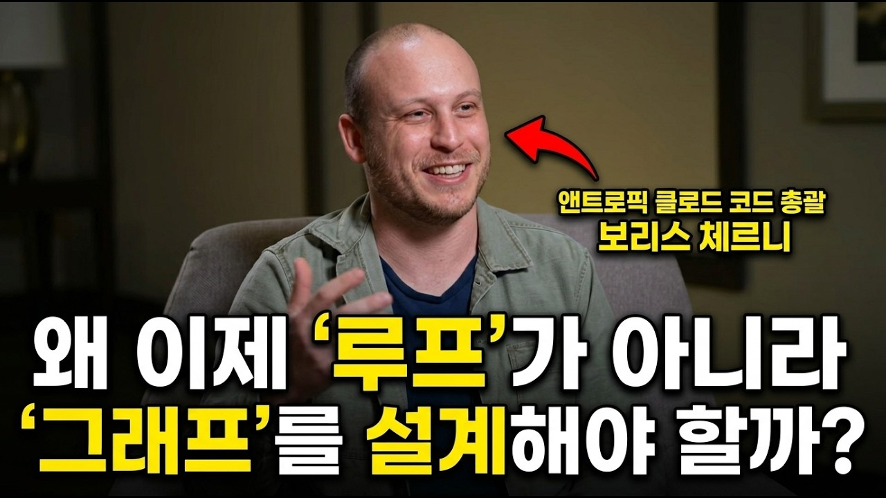

# [한영자막] 왜 이제 '루프'가 아니라 '그래프'를 설계해야 할까?

앤트로픽 클로드 코드 총괄 보리스 체르니가 AMD 마크 파퍼마스터와 나눈 인터뷰입니다. 에이전트를 하나씩 다루던 시대를 지나, 이제 왜 루프와 그래프 단위로 개발을 설계해야 하는지 들어보세요.

주요 포인트
- 클로드 코드가 출시 후 6개월간 부진했다가 오퍼스 4 이후 폭발적으로 성장한 과정
- 엔지니어 한 명당 코드 출력이 8배 늘어난 비결, 병목을 하나씩 풀어가는 방식
- 에이전트 1개에서 1,000개까지, 조직이 자연스럽게 거치는 확장 단계
- 프롬프트 인젝션 방어와 신뢰, 검증을 위한 다층적 안전 설계
- AMD가 무어의 법칙 둔화를 에이전틱 워크플로로 돌파하는 방법

## Table of Contents
* [00:00:00] Introduction: Claude Code’s Breakthrough
* [00:03:52] From Foundation Models to Coding Agents
* [00:07:49] Claude at the Center of Every Workflow
* [00:13:51] Un-bottlenecking Work and the New Engineering Abstraction
* [00:17:59] Scaling from One Agent to Thousands
* [00:23:31] ROI, Experimentation, and Democratization
* [00:27:55] Evaluation, Benchmarks, and Product Intuition
* [00:29:42] Trust, Verification, and Security
* [00:34:13] Scaling Safely
* [00:35:22] AMD and the Next Wave of Agentic Workflows

## Introduction: Claude Code’s Breakthrough [00:00:00]

**Mark Papermaster:** And honestly, Claude code didn't work very well for you know, the first 6 months. It It actually It took time. It took time to catch up. [00:00:00 → 00:00:09]

And it wasn't until I would say Opus 4 in May of 2025. [00:00:06 → 00:00:13]

**Boris Cherny:** This year at Anthropic, we've seen an 8x increase in code output per engineer. And this is just unheard of in the industry. Like, you know, typically companies see something [00:00:13 → 00:00:26]
[music] [00:00:22 → 00:00:23]
like a few percent a year while building bigger and bigger things. [00:00:13 → 00:00:26]

**Mark Papermaster:** So, it won't just be features. It's going to be products. [00:00:26 → 00:00:28]

**Boris Cherny:** every time it didn't work, I learned a lot. And every time I did a startup, I wore a different hat. It was sometimes engineering, sometimes business, sometimes product, sometimes design. [00:00:28 → 00:00:39]

You know, you know, you know, like at a at a small company, sometimes you have to do all the stuff. And so, from from kind of the beginnings of my career, I've kind of felt this need to break down the walls of, you know, engineers do this and designers do this. And um at some point, I, you know, I did a bunch of different startups. [00:00:36 → 00:00:59]

I worked in VC for a little bit, then I ended up at at a for for a little while. [00:00:57 → 00:01:02]

**Mark Papermaster:** Mhm. [00:01:02 → 00:01:03]

**Boris Cherny:** And um something that I've I've always done as I build products is I build developer tools so that I can build better products. Because there's this sort of intuition that if you have an idea and you want to build it, the easier it is to use your tool, the better you can build it. Imagine if you're, you know, a carpenter and you know, like hammers are really badly designed. [00:01:03 → 00:01:27]

Let's say it takes like, you know, let's say it takes like three people to hold a hammer to hammer a nail. You're going to hammer a lot less often. [00:01:25 → 00:01:32]

**Mark Papermaster:** Yeah. [00:01:32 → 00:01:32]

**Boris Cherny:** But if you have like a really well-designed hammer and it's very easy to use and you enjoy using it, then you're going to hammer a lot of nails. And so, you know, like when I when I build product, I love to build the developer tools that make it even easier to build the product. And the thing that matters is not the tool. [00:01:32 → 00:01:46]

The thing that matters is the end result of the product. And so, this is the, you know, this is the mindset that I took to Meta. This is the mindset that I that I brought to Anthropic. [00:01:45 → 00:01:54]

You know, at Anthropic, the thing that matters more than anything is the safety mission. This is the thing that brought me there. This is I think that just the most important problem to work on. [00:01:52 → 00:02:02]

And, you know, my role at Anthropic is to build the tools that let people experience the models so they can understand where this thing is headed. And that lets us make it a little more safe and a little more capable and hopefully a little more delightful to to use. [00:02:02 → 00:02:18]

**Mark Papermaster:** Well, I tell you, I love hearing that. There's There's a bit of Malcolm Gladwell in your in your story of the ark because you look at what you've done and you you probably couldn't have done it without that myriad of experiences. I'm I'm very fortunate in chip design. [00:02:18 → 00:02:33]

I've had a chance to be in super small teams where we had to do really every aspect of chip design and and I feel so fortunate because of my career it gave me a perspective of how all the myriad of pieces have to come together. And you were so hands-on in the myriad of roles uh and you think about how in Anthropic you're having to put it all together to enable people to have that end result and to have it be safe. [00:02:31 → 00:03:00]

**Boris Cherny:** Yeah, absolutely. And you know, like when we hire for the team, this is the kind of people I look for, too. Like I I I typically don't look for a person that, you know, has a computer science education and then, you know, like worked in, you know, big big tech for for whatever. [00:03:00 → 00:03:13]

I like I love people with non-traditional backgrounds. I love people with all sorts of different experiences cuz the more that you've seen, the more different ways you've approached problems, the more you can bring to this problem. [00:03:11 → 00:03:23]

**Mark Papermaster:** Yeah. You have a passion for what you do and I assume you look for that in the people you're hiring, as well. [00:03:23 → 00:03:29]

**Boris Cherny:** Yeah, yeah. And I love people that are passionate not just about their work, but about other stuff, too. So, like I love people with like, you know, side projects and hobbies and just like if someone has like an amazing personal website uh and also does, you know, leather working on the weekend and they've gotten to a point where they do it at like a very high level, that's a really good sign. [00:03:29 → 00:03:49]

This is a person that's going to perform well on the job, too. [00:03:48 → 00:03:52]

## From Foundation Models to Coding Agents [00:03:52]

**Mark Papermaster:** I would just love to explore a little bit of how all of that background and you you jumped in uh with Anthropic, could you have imagined when you uh started just thinking like hey, we could do really a code assist and auto complete or or or or or you know, just really helping code segments. Uh tell me when you started realize that you could progress from there uh to really these agentic processes that now um are are significantly uh advancing code to where where basically everyone's saying, "Look, this we're not code we're we're using uh coding agents. We're not coding in the traditional way." Which means it's it's now we've fundamentally transformed software development. [00:03:52 → 00:04:38]

And it's all happened in a period of months. How you know, what did you imagine that? [00:04:35 → 00:04:44]

**Boris Cherny:** No. [00:04:44 → 00:04:52]
[laughter] [00:04:45 → 00:04:46]
That's That's no. When when I joined Anthropic, the model at the time was Sonnet 3.5. [00:04:44 → 00:04:52]

And that's the first model that I think broke through the mainstream. And it made people realize that, "Oh man, maybe there's something to this idea of a general model that if you apply it to a particular problem like coding, [00:04:50 → 00:05:03]

**Mark Papermaster:** Yeah. [00:05:03 → 00:05:03]

**Boris Cherny:** it can be really good." And um you know, like for for Anthropic, this is just always been the research direction. Like we we have always been focused on uh safety and uh uh security and enterprise and coding. It it's just always been this laser focus. [00:05:03 → 00:05:18]

And we wanted to build these models for a long time. The reason we want a good coding model is because the model exists as software. And as it gets more intelligent, the way it interacts with the world is through software. [00:05:18 → 00:05:32]

And so you want the code that it writes to be good so that it can interact well, so that we can study it and we can make it safer and better aligned. And so, you know, for a while for Anthropic, we knew we wanted to build some kind of coding product. And my job was to figure out what's that product. [00:05:32 → 00:05:46]

And when I joined, again, it was it was Sonar 3.5 and all the products at the time, they were fancy autocomplete. And you know, at the time this was cutting edge and I remember my first time, you know, using some of these products and it was just amazing. Um and we felt that very soon the models are going to get to a point where they're going to be much more capable than us. [00:05:46 → 00:06:09]

So, for coding it's not a matter of completing a single line. The model is going to be able to write an entire function, an entire file, an entire feature, an entire project. Now, I think by the end of this year they're going to be able to build entire businesses. [00:06:07 → 00:06:20]

And so, you know, we we kind of saw this uh you know, that we call this the exponential and this is just the way that, you know, the models are developing. There's these scaling laws that describe the way that model intelligence goes up over time. Somehow the laws are continuing and in fact it's accelerating. [00:06:20 → 00:06:37]

And you know, it's an empirical kind of observation. It's not obvious why it keeps happening, but it seems to keep happening. And so, all we did is we kind of crease this line where we're like, all right, right now the model is here, it's going to get here. [00:06:37 → 00:06:48]

The product that's here is not going to be enough to let people experience the power of the model. And so, we wanted something that was purely agentic. And honestly, Claude Code didn't work very well for, you know, the first 6 months. [00:06:48 → 00:07:03]

It it actually it took time. It took time to catch up. And it wasn't until I would say Opus 4 in May of 2025 where it really started to work. [00:07:01 → 00:07:13]

And you know, like since then the growth with the growth for, you know, the product has been exponential, also. It was not at first, but that's when it became exponential. And um we've been finding more and more ways to to use this. [00:07:13 → 00:07:27]

Like as the model gets more sophisticated, we figure out more ways to unlock it in the product. We launched Claude Tag and this is kind of the latest iteration of this. It's long-running asynchronous agent that you interact with like a coworker. [00:07:25 → 00:07:37]

It has great common sense. It has a great sense of when to jump in and when not to. And you know, this will just keep happening. [00:07:35 → 00:07:45]

We're going to keep disrupting ourselves. So, we're going to keep figuring out what is what's the next form factor. [00:07:43 → 00:07:49]

## Claude at the Center of Every Workflow [00:07:49]

**Mark Papermaster:** You know, you talk about sort of predicting this this uh this line of progress. But, to me, uh how did you how did you uh think about architecting, you know, really multi-agents and how uh running these multiple agents can actually have us rethink how we implement in our workflows. I mean, that that it it was what has been shocking to me is we actually have the opportunity to re-architect, re-engineer how all of us are getting our work done. [00:07:49 → 00:08:22]

And I I have to wonder, did this was that architected uh into your development or is that sort of just a natural outcome of the capabilities that you were developing? [00:08:19 → 00:08:34]

**Boris Cherny:** I think it's a little bit of both. If I think back a couple years, how did how did we use models? We, you know, like they did this like one-line autocomplete. [00:08:34 → 00:08:43]

And and we had agentic workflows, always what we called agentic workflows. But, it was essentially these deterministic systems where a step at a time might call out to an LLM to do some bit of computation, but fundamentally, the workflow was deterministic. And I I think what's changed as the model got more intelligent is we've realized actually it's much better to use the model as the coordinator for this workflow. [00:08:41 → 00:09:03]

And so, what you do is the model drives, and you give it tools to pull in context. You give it tools to interact with outside world. You ask it to do something, and then you let it figure out how to orchestrate these. [00:09:03 → 00:09:16]

You no longer tell it, "Okay, you do step one, then step two, and then if not two, then, you know, this, and then else this." And it's just not how it works anymore. You give it a goal, you give it the starting point, you give it access to tools, and then it will figure it out. And this has happened, I think, as models got more intelligent, this is just overwhelmingly the reason. [00:09:14 → 00:09:35]

But, I I I think like within Claude Code, we've also learned this. At the very beginning, we would kind of spoon-feed the model context. And then, as the model got more sophisticated, we realized, "Okay, maybe actually this isn't it." And we moved away from that a little bit. [00:09:35 → 00:09:50]

And, you know, like for example, we have this like file called claude.md. It's loaded for every session. And I think more and more what we're seeing with customers is they're actually moving more to skills. [00:09:48 → 00:09:59]

And they're moving more to tools and more to MCPs because this way the model has a little bit more control over how to load this on. [00:09:59 → 00:10:07]

**Mark Papermaster:** Well, I have to ask, I mean, you guys across Anthropic are using Claude every day. I mean, so you're you're customer number one. Like before the rest of us see it, uh you know, you're you're making sure it it accomplishes what you need. [00:10:07 → 00:10:25]

Tell tell us about your your typical day. I mean, it it is it is it is is Claude like an extension of your of your body as you're as you're creating your work output? [00:10:22 → 00:10:35]

**Boris Cherny:** Yeah, this is a this is sort of the weird thing about how Anthropic works. At Anthropic, Claude is at the center of everything that we do. It's every single business process, every single bit of everything everyone does throughout the day. [00:10:35 → 00:10:48]

Claude is just at the center of it. Um a way I sometimes describe it is um let's say you're a new hire and you're onboarding at Anthropic. Typically, if you have a question like uh you know, "Where is the office? [00:10:45 → 00:10:58]

Where's the address?" You know, like at a you know, most companies, you would go and search a wiki or you would ask a coworker. At Anthropic, you ask Claude. If you have a question like, "Where's the codebase and how do I get access to it?" Uh again, you don't go to a wiki, you go to Claude and you ask Claude. [00:10:57 → 00:11:13]

If your question's like, you know, like I took a trip, I have an expense report. How do I file that expense report? And this is how it begins. [00:11:13 → 00:11:20]

But then, as you kind of get deeper into the work, Claude remains at the center of everything. And so, you know, Claude writes the code, uh it does the the code review, it does the security review, um it brainstorms and comes up it come it comes up with new product ideas. It aggregates user feedback. [00:11:20 → 00:11:38]

It triages incidents. Every single part of the engineering SDLC, Claude is at the center of it, too. [00:11:36 → 00:11:43]

**Mark Papermaster:** Yes. And, you know, like the now now this is happening not just for engineering. It's happening for product and for design and for marketing and for GTM, for every function. [00:11:43 → 00:11:53]

This is what we're seeing and the tools look a little different. [00:11:51 → 00:11:54]

**Boris Cherny:** Yeah. It might not be, you know, Claude code in a in a terminal. It might be, you know, a tool like Coda instead. [00:11:54 → 00:12:00]

Um, but it's still Claude at the at the center. And I think this is actually what I see with the most successful adopters of of Claude is you put it just at the center of every process. It We we were talking a little bit before about a my my favorite Harvard Business Review article from like a from the '90s and it it was talking about like I think it was like '92 or '96 or or something and it was it was titled something like computers are here, why are we not seeing the productivity benefits? [00:11:58 → 00:12:25]

And, you know, like this was a big question that people were debating. And I essentially what the case the article made was that there were two kinds of companies. There was one kind of company that they took a computer and they put it somewhere in the corner of the office and then they kept all their, you know, paper and pen processes and all their filing cabinets and everything stayed as is, but now there's a computer in the corner. [00:12:25 → 00:12:45]

These companies are not seeing a productivity improvement. And then there's the companies that took the paper, you know, the the filing cabinet and threw it away. They took the paper and pen and burned it. [00:12:45 → 00:12:54]

**Mark Papermaster:** Right. And now there's a computer at the center of every process and those are the companies that unlock productivity improvements. And, you know, since the beginning of this year at Anthropic, we've seen an 8x increase in code output per engineer. [00:12:54 → 00:13:07]

[clears throat] [00:13:07 → 00:13:07]
And this is just unheard of in the industry. Like, you know, typically companies see something like a few percent a year. And, you know, now our biggest customers that are using Claude code, now they're starting to see something like this. [00:13:07 → 00:13:17]

They're seeing like, you know, 50, 100%, 150% improvement. And the thing that we did to get to the, you know, the 8x is we systematically improve a bottleneck at a time. So, you know, first coding is the bottleneck. [00:13:16 → 00:13:35]

We we throw quad at it, and quad does the coding. The next bottleneck is the code review, and you know, then we have quad do that. Um the next bottleneck is, you know, like generating materials for GTM. [00:13:32 → 00:13:45]

You know, maybe we throw quad at that. And so, just like one step at a time, we un-bottleneck every part of the process. [00:13:42 → 00:13:51]

## Un-bottlenecking Work and the New Engineering Abstraction [00:13:51]

**Mark Papermaster:** Well, what I love that is because you're driving your development by your own real-world needs. It's It's a self-reinforcing cycle uh to make sure that that uh the value of where you're spending your your resources. You're an AI-native company, so you're you're adopting that change at an astonishing rate. [00:13:51 → 00:14:11]

But, I'd love to hear your experience of how you think about the role of of leaders, of engineers. I just think you're ahead of most of the rest of us in starting to see that at play, uh and seeing how you're you're taking people with you. [00:14:11 → 00:14:29]

**Boris Cherny:** Stepping back a little bit, engineering is this thing that it's just always been changing. And, you know, as engineers, we're no strangers to this. You know, my my grandfather actually programmed punch cards in the in the Soviet Union. [00:14:29 → 00:14:43]

Um you know, like I I grew up I I programmed like basic and assembly growing up, and then, you know, I kind of learned higher-level languages like as as I went. I I worked in JavaScript for a while, and in JavaScript, every every engineer knows the frameworks change like every month. There's a new set of frameworks, and everyone has to learn new skills. [00:14:43 → 00:15:00]

And so, so I think like for for engineers, the it's always been changing. The languages have always been changing. The frameworks have always been changing. [00:14:58 → 00:15:07]

What's happening now is it's accelerating. And so, we went up a level of abstraction. We went from, you know, hardware to punch cards, then we went from punch cards to source code. [00:15:05 → 00:15:16]

Now, we went from manipulating source code to agents. And now, we're going up a level again from managing agents to managing like loops and routines. And the crazy thing is that these vast two steps happen in the span of two years. [00:15:14 → 00:15:29]

It's just it's faster than than it was before and I think it'll continue to accelerate. And so what when it when I think about the engineers and the the people that are really successful, I think it's people that are empirical and and curious. So, you're able to look at the data and you're able to adjust the approach. [00:15:29 → 00:15:46]

You don't always assume the same thing you always do is going to keep working. You're able to kind of take feedback from your work. And so if there's new data, you can have a different approach. [00:15:45 → 00:15:55]

Um it's people that are autonomous. Because as engineering is no longer the bottleneck, now we're actually bottlenecked on the speed with which we can generate good ideas and bring them to market. And you know, I would do so safely. [00:15:55 → 00:16:09]

And the people that are really effective at this, they're not people that, you know, like they have to have this big process for how to get an idea to market and they need to collaborate with like 10 other teams to do it. They're sort of like one-person armies. It's like the the people that are most effective are this kind of like CEO archetype. [00:16:09 → 00:16:26]

Like you're you're able to come up with an idea, you're able to talk to users, you're able to look at the data to build, to iterate, and to to bring it to the market. And we actually see this coming not just from engineers, but from all sorts of functions. Um I think I think having this engineering background helps today, but it's actually I don't I don't think it's really essential anymore to to doing this kind of thing. [00:16:23 → 00:16:46]

**Mark Papermaster:** But it does change the kind of skills that we need in So, you need to be adaptable. You need to be uh fearless of change. I love what you said. [00:16:46 → 00:16:58]

You you have to be curious. You have to, you know, really be experimenting. I mean, that's part of what I think this these new agentic workflows, uh new meaning, you know, like like we've we've said you literally in the last uh you know, 7 months to a year, it changes how you can iterate. [00:16:56 → 00:17:13]

So, how how do you be curious? You can experiment now in ways you could never experiment before. I mean, your learning cycles are vastly accelerated, aren't they? [00:17:13 → 00:17:23]

**Boris Cherny:** Yeah, totally, totally. And And I think it's on, you know, it's on leaders to make space. If you don't adjust for this and you don't create space, everyone's going to keep doing it the old way and you kind of have to force everyone to do it the new way. [00:17:23 → 00:17:33]

**Mark Papermaster:** Yeah. [00:17:33 → 00:17:33]

**Boris Cherny:** But really, for a lot of people, it's actually just really exciting to get to try all these tools, to get to experiment. And so, I actually see a lot of my role as creating space for people to try stuff out, to feel safe doing it. You know, they're not going to get a bad performance review if they, you know, experiment with a new idea cuz it might actually work. [00:17:33 → 00:17:50]

Um and my other job is to just give people context. So, to give them business context, product context, so that they can make better decisions. [00:17:50 → 00:17:59]

## Scaling from One Agent to Thousands [00:17:59]

**Mark Papermaster:** But companies that aren't AI native, uh these are lessons, like what you went through. That That's going to It's going to take uh showing best practice. It's going to be, you know, educating the the workforce and and really driving culture change uh to be as you described. [00:17:59 → 00:18:14]

**Boris Cherny:** Yeah. Yeah, that's right. And And our job is to to help companies along the way. [00:18:14 → 00:18:19]

You know, like One One thing that I've seen companies go through is this kind of natural transition from not using AI to, you know, every engineer running one agent to every engineer running 10 agents, [00:18:18 → 00:18:29]

**Mark Papermaster:** Yes. [00:18:29 → 00:18:29]

**Boris Cherny:** then 100 agents, then 1,000 agents. And there there are sort of these like traits that go with each of these. So, you know, with one agent, uh engineers are using this agent to kind of like write the code and you're kind of focused on it. [00:18:29 → 00:18:43]

You're still kind of single threaded, you're working on one task. Then, at some point, you kind of get to the point where you kind of trust the agent and you're like, "Okay, maybe maybe it's actually doing the right thing. Maybe while it works, I can start a second one." [00:18:41 → 00:18:53]

**Mark Papermaster:** Yeah. [00:18:53 → 00:18:53]

**Boris Cherny:** And engineers kind of naturally figure this out, like maybe you'll have like multiple checkouts of the same repository or, you know, multiple views of the same code. So, while the agent works, you can uh you know, work on something else and maybe you can scale up to like 10 agents this way. What you're doing is you're essentially round robining through the agents. [00:18:53 → 00:19:09]

You start to work in one, you move on to the second. You You do the work there, you move on to the third. And this is kind of the workflow that we've now support really well in the the desktop app. [00:19:08 → 00:19:18]

Um so for both for quad code and for core work, you start a session, you just start a second session. You can you can move on. You can have multiple stuff running in parallel. [00:19:18 → 00:19:26]

But then it gets really interesting once you scale with this up a little bit more. And I I think like when I look at most companies, they're still somewhere between step one and two. [00:19:25 → 00:19:33]

**Mark Papermaster:** Yes. [00:19:33 → 00:19:34]

**Boris Cherny:** And when I look at Anthropic, we're probably somewhere around step three on average. So most engineers are running dozens or hundreds of agents. And the way you do this is you have the agent run another agent. [00:19:34 → 00:19:46]

And we have a lot of tools for this. Um So for example, if you're on the [00:19:44 → 00:19:50]

**Mark Papermaster:** Sub agents. So you have agents running basically sub agents. Is that how you think about it? [00:19:50 → 00:19:55]

Or we've coined that phrase. If I don't know if it's industry standard. [00:19:53 → 00:19:58]

**Boris Cherny:** No, no, that's exactly it. So you have the sub agents and the sub agents can start sub agents. So it can it can actually go quite deep. [00:19:58 → 00:20:04]

And for quad code, we support up to five layers now of this kind of nesting. And there's different ways to support this on the product side. So you know, we've been experimenting with for example, cloud execution. [00:20:03 → 00:20:14]

So instead of the agent running locally on your computer, it runs in the cloud. And you can start an agent from the desktop app or from the mobile app. And I actually do a lot of my coding from my phone now. [00:20:12 → 00:20:25]

**Mark Papermaster:** I love that. [00:20:25 → 00:20:26]

**Boris Cherny:** And it just runs in the cloud. And this is actually what lets you scale up. And then you know, we we we're we're continuing to iterate on this to make it even more native and to scale up to thousands of agents. [00:20:26 → 00:20:36]

And the way we get there is with dynamic workflows. And this is essentially using cloud to orchestrate just very large teams of agents to do the most complex work. Like large code base migrations. [00:20:34 → 00:20:47]

Like I think Stripe just used this to migrate um You you use something like like it would have taken months and then it took like four days to do like a 10,000 line Scala to Java migration. Um there's a lot of companies that are using this for large migrations. Like we just migrated Bun from Zig to Rust. [00:20:45 → 00:21:03]

And this is like a JavaScript runtime. It's a lot of code. And um, so for the for these kind of like very, very big workflows that would have taken weeks or months or years, essentially a way to do it is this divide and conquer where you give the model a lot of agents and you just tell it like go go figure it out, do this big task. [00:20:59 → 00:21:20]

**Mark Papermaster:** So it goes back to what we said earlier. Uh it uh it's going to be a journey. It's going to take uh it's going to take education. [00:21:20 → 00:21:28]

Uh and it is going to take uh culture change. And uh when you do it right, uh we actually have similar examples of what you just described. We have uh we we have uh created a rust-based uh application. [00:21:28 → 00:21:43]

Our lead of uh AI software development uh did it over a weekend. Uh for an application that we needed. Uh we were we we thought it could would be a competitive gap. [00:21:40 → 00:21:52]

Uh and and over a weekend now we had to validate it and get it through all the, you know, the test regressions and everything where it could be shipped. But that just is un was unheard of before. I mean uh it it's just astonishing to me uh what multi-agents can do. [00:21:49 → 00:22:09]

Again, you go back to this projection you had. It sounds like that's this is exactly what you expected. Though. [00:22:07 → 00:22:14]

**Boris Cherny:** Yeah. Right? I think that this is this is what we expect, yeah. [00:22:14 → 00:22:18]

You know, you never you never know exactly how it's going to scale. But if you know, for some reason you know, this is uh this is continuing and you know, like for for these traditional scaling laws and it it it's funny that the people that wrote the scaling laws paper, like the first few authors like went and started Anthropic. Cuz I think they knew where it was going. [00:22:17 → 00:22:35]

They know that safety becomes very important, security becomes very important. Um and so, you know, traditionally the the scaling laws say that we scale as a function of the the size of the network, the amount of data, and the amount of compute. And what we're seeing now is it's also a function of the test time compute. [00:22:34 → 00:22:52]

And you know, like essentially it's a fancy way of saying how many tokens you throw at it. And so, from a product design point of view and kind of model training point of view, we want to make it so you can more productively throw more tokens at a problem to get a better result. Cuz if you do it naively, you spend more tokens, but you don't get a better result. [00:22:50 → 00:23:10]

And so like one one example of this is effort levels. So like in the model, you can configure the effort. The higher the effort, the more the maximum amount of tokens the model will be willing to spend on that problem. [00:23:07 → 00:23:18]

And so this idea of like multi-agent and dynamic workflows, I actually see it as another version of test time compute. You throw more tokens at it and by orchestrating the agents and having the model orchestrate it, you can use these tokens productively to to get a better result. [00:23:18 → 00:23:31]

## ROI, Experimentation, and Democratization [00:23:31]

**Mark Papermaster:** And Boris, I've heard you uh state that it's really important to throw those tokens at it because otherwise you don't even know the roofline of what you can achieve. Maybe you can share with our our audience what what you mean by that. [00:23:31 → 00:23:45]

**Boris Cherny:** Yeah, so I I think there's a lot of companies right now that are thinking about ROI. And and how you measure this. And I think some companies are actually thinking about it wrong because they're focused purely on the I part of it. [00:23:45 → 00:23:58]

And so they think about, okay, here's my investment, how do I reduce it? How do I cost cut? Obviously, this is important and you should just do this and you know, there's a bunch of tools for this. [00:23:58 → 00:24:05]

You can use Opus plan mode, you can use advisor models, you can use a lower effort setting, you can use a cheaper model. So maybe everything doesn't need Opus or you know, maybe you can use Haiku, you maybe you can use Sonnet. And of course you like you write evals to kind of figure this out. [00:24:05 → 00:24:20]

But I think actually the far more important part is the R. So how do you improve the return that you're seeing from models? And and I think the biggest lesson here that we've seen from successful customers is you want to give engineers the freedom to experiment. [00:24:20 → 00:24:36]

You want to give everyone the freedom to experiment so that they come up with new use cases. You want people to experiment and you want to create this culture where people feel safe experimenting and they will surprise you. It's not going to be your most senior engineer that comes up with like some brilliant idea. [00:24:34 → 00:24:49]

It's going to be maybe a new grad. You know, it's not going to be some engineer that figures out how do you automate this marketing process? It might be a marketing person somewhere in the corner of the org that you've never met but that comes up with a brilliant idea in there because they were experimenting. [00:24:47 → 00:25:01]

And so the thing you want to encourage up front is this experimentation. If there's an internal use case and it takes off or there's a product and it takes off and it uses a lot of tokens, but it's successful, that's when you go in and you want to optimize it. But if you don't do the first part, you'll never find the opportunity. [00:25:01 → 00:25:15]

And um then once you find opportunity, then then you can optimize it like any other engineering problem. [00:25:15 → 00:25:21]

**Mark Papermaster:** Forrest, I love that description because you what you also highlighted is there's a democratization of opportunity. We've actually had junior engineers uh take a problem a chip design problem that was a bug. Uh we had an engineering team had been working for weeks, couldn't solve the bug. [00:25:21 → 00:25:40]

And one of our junior engineers said, "I I think I can solve that." Uh through a set of a genetic uh process at it and came and solved this incredibly, you know, remote you know, 20 things that once had to occur for this uh chip bug to to realize itself. This was obviously before we shipped a product. This was in our our debugging test phase. [00:25:38 → 00:26:02]

It actually shocked to the core a number of our senior engineers that then and that actually drove up adoption [00:25:59 → 00:26:29]
[laughter] [00:26:06 → 00:26:07]
of these approaches at AMD because every time you actually have to experience it. Uh you you can talk, you can give it lip service, but once you actually have a problem that you couldn't solve or uh or actually experience a huge productivity gain, I just leader after leader, I see them immediately converted on the spot to believers. [00:25:59 → 00:26:29]

**Boris Cherny:** That's right. That's right. And then you need a certain amount of humility also going in. [00:26:29 → 00:26:33]

Like I think this is a lesson I I had to learn like over and over and over again. I tried to do things my way, which was, you know, before I just kind of gave up and like let quad drive. I I kind of had to I I I manually did it. [00:26:33 → 00:26:46]

And you know, for example, maybe this is like a year ago, it was like debugging a a bug also. And um I remember there was like one time I was debugging something and there was a new person that just joined the team and I was debugging it by hand. I was running up, you know, a profiler to figure out what's going on and they just, you know, asked Quad to do the same thing. [00:26:46 → 00:27:03]

And I was like, "No, no, no, there's no way Quad won't be able to figure it out." [00:27:03 → 00:27:06]

**Mark Papermaster:** Even you said that. [00:27:06 → 00:27:08]

**Boris Cherny:** Even I Even I said that because, you know, in some ways like I'm biased cuz I've worked with Quad through all the model generations. And so somewhere in my head I was still stuck on this like older model generation, which is just not where the capability was at that point because the model was improving. Um and within 20 minutes they came up with a solution and I didn't. [00:27:08 → 00:27:26]

**Mark Papermaster:** Wow. [00:27:26 → 00:27:27]

**Boris Cherny:** And they they had the right one and I've just, you know, learned this lesson over and over. And I think it's like as the model gets more advanced my relationship with the model changes. And it's less that like I have to handhold it and I have to micromanage it. [00:27:27 → 00:27:40]

And it becomes more like working with a senior engineer. I I trust them. I give them context. [00:27:40 → 00:27:45]

I give them goals. I check in. The you know, the less I trust them maybe the newer they are to the problem, the more often I check in. [00:27:43 → 00:27:50]

Um but really it's about setting the right guardrails and then letting the model do the work. [00:27:50 → 00:27:55]

## Evaluation, Benchmarks, and Product Intuition [00:27:55]

**Mark Papermaster:** Boris, I have a question for you. I mean, it is a democratization of what teams can do. And so what what we also see is it um people will be running in parallel and we're going to have five ways to drive a you know, a improvement of a workflow. [00:27:55 → 00:28:13]

How do you think about that? How do you think about measuring and you know, and how um you know, how how do you would an intrepid and in those cases, you know, pick the solution go with? I mean, what's the role of like benchmarking and measuring to be able to in this agentic area make these decisions and and not end up with uh this, you know, just massive bifurcation of of approaches, you know, as we all are trying to solve problems? [00:28:13 → 00:28:39]

**Boris Cherny:** Yeah, so I think it's exactly this. There's There's actually two tools. One is uh Evals, also benchmarks. [00:28:39 → 00:28:45]

So then one is Vibes. And I think both have their place. Um for something like a workflow that you're going to repeat maybe thousands, tens of thousands, hundreds of thousands, millions of times, you definitely want to have evals because the evals let you measure, let's say a new model comes out, you swap it in in the harness, and you want to make sure that it improves. [00:28:43 → 00:29:04]

Um and this gives you a way to measure it. For other things like maybe a product experience, uh vibes actually go pretty far because there's a cost to writing evals, you don't want to write it for everything. Um so, you kind of want to like pick and choose when when can intuition when you use something? [00:29:04 → 00:29:19]

When when when does that tell you something and then when do you actually need an eval to tell you something? And we when you have this bifurcation in all these different products, I think one of the the blessings of uh you know, like having having a model is it's actually very easy to migrate and merge code. And so, like when, you know, you pick the approach that you want, usually it's quite easy to just ask Claude by K like migrate all these other call sites to this, you know, workflow and you know, that's that. [00:29:17 → 00:29:42]

## Trust, Verification, and Security [00:29:42]

**Mark Papermaster:** I'm going to shift gears yet again a little bit. I want to uh talk about something that that all of us have to focus on and and I think it's just actually centered in Anthropic in the approach you have taken and that's uh the broad topic of trust and verification. Um I had on a previous episode uh Kathy Pham who who lectures at um at Harvard and we talked about uh uh you know, governance and how you build in the process. [00:29:42 → 00:30:09]

So, there's one side, there's a governance of how to ensure there's safe AI and then there's the verification, like how do you ensure um that you're driving the accuracy that that you need because both both come together to provide trust in in the deployment of AI. I know it's important to you, you you said it from the outset in our in our chat here, but maybe we could just spend a minute um thinking about like how do you how do you build that in? Like is it is it a a checklist or is it is it actually built in your your own workflows uh that that you run every day. [00:30:07 → 00:30:45]

**Boris Cherny:** Yeah, I mean it's it's a it's many many layers. And exactly like you said for for Anthropic, this is just at the core of what we do. As models get increasingly powerful and they get more and more central to business process, you need it to be safe, you need it to be reliable, you need it to be trustworthy, you need it to be aligned with uh whatever the intent is of of the person that's using the model. [00:30:45 → 00:31:07]

So, you know, there there's just like so many ways that that we approach this at different layers. The most basic is model alignment. And you know, we have a very large team working on it. [00:31:07 → 00:31:17]

We publish a lot of research about it and we have a lot of blog posts about the what we're learning. And this is just many many years of research go into this. And uh essentially like, you know, there there's a lot of things that go into alignment, but you know, for example, an element of alignment is uh truthfulness. [00:31:16 → 00:31:31]

So, you know, the model kind of says the right thing. Another element is uh not being sycophantic. Because a failure mode for models, for example, is agreeing with everything the user is saying. [00:31:31 → 00:31:43]

But actually a a good model that I like working with will push back. [00:31:43 → 00:31:47]

**Mark Papermaster:** Mhm. [00:31:47 → 00:31:48]

**Boris Cherny:** And I think with with some of our later models, so like Opus 4.7, definitely Opus 4.8, um we made a lot of progress on this. Um And so, if we train kind of the model well, then if I suggest something and it's a bad idea, the model will push back. And it makes me trust it a little bit more. [00:31:48 → 00:32:07]

There's other layers, too. So, you know, when we talk about trust, another element of this, you know, there's a lot of stuff wrapped into trust, but another element is uh security. And so, this is another element that goes into training is, for example, anti-prompt injection training. [00:32:07 → 00:32:22]

And on every model we publish, there's a system card that talks about how resilient is the model to common attacks like prompt injection. And Opus 4.7, Opus 4.8, Fable, these are just the least prompt injectable models in the industry by margin of I think like five or 10x. It's It's like a really big margin. [00:32:22 → 00:32:41]

**Mark Papermaster:** So, you you had to architect that in. I mean, how did you do that? [00:32:41 → 00:32:45]

**Boris Cherny:** There's a lot of training that goes into it. So, you know, this is this is just part of the model training process. Um and we we train the models to be resistant to these kind of attacks. [00:32:45 → 00:32:55]

And especially when you combine it with a runtime classifier for prompt injection, which we actually also do, the success rate in practice now is near zero. And obviously this is important because as the models do more, as they interact with more systems, being resistant to these very common attacks becomes very important. As the model gets more capable, we need a way to run the model for a longer period of time safely. [00:32:53 → 00:33:17]

And you know, now there's workloads that run for days, weeks, months at a time. And obviously this means that there can't be a person sitting there. And around the same time what we were realizing is if there's a person that's deciding yes or no every time, at some point the person actually just stops reading and they just say yes, yes, yes, cuz they're tired of pressing yes. [00:33:14 → 00:33:37]

And I noticed myself doing this, too. You know, I I I would kind of stop reading the bash commands. I would just say yes. [00:33:37 → 00:33:43]

And our security people were also realizing this. [00:33:43 → 00:33:56]
[laughter] [00:33:46 → 00:33:47]
Um and so they the thing that they started working on is is there a way to route this to a classifier so the classifier can decide. And you know, they started this work. [00:33:43 → 00:33:56]

It took uh many months to to kind of get this to a mature state. And in the end through uh evals, uh through red teaming, through pen testing, we're able to show that this is actually much safer. [00:33:54 → 00:34:08]

**Mark Papermaster:** Yeah. [00:34:08 → 00:34:08]

**Boris Cherny:** And so, you know, at Anthropic we run on auto mode. And we we recommend this to all our customers, too. [00:34:08 → 00:34:13]

## Scaling Safely [00:34:13]

**Mark Papermaster:** Well, Boris, uh I I I have to ask you. I mean, you you you're removing bald and next at at every stage, but how do you think about scale going forward? I mean, uh the complexity of what you're taking on at and and Anthropic just is it just as you said, growing it it dramatically at every release. [00:34:13 → 00:34:32]

Um how how do you how do you think about managing scale, uh, actually maintaining that pace? [00:34:32 → 00:34:37]

**Boris Cherny:** Yeah. Well, I I think a lot of it comes down to following the scaling laws and, uh, continuing to reinvent the product as it scales up. Um, a lot of it is, you know, about finding awesome partners to work with, um, to, you know, like support the scale and, you know, like support this kind of compute. [00:34:37 → 00:34:57]

Um, and, uh, I I I I think a lot of it is, uh, figuring out the right guardrails so that we can make sure it's safe. Cuz, you know, like again, as the model becomes more and more core to what we do, um, we have to make sure that it does the right thing. [00:34:57 → 00:35:12]

**Mark Papermaster:** Yes. [00:35:12 → 00:35:12]

**Boris Cherny:** But, I'm actually, Mark, I'm curious how you think about it. Like, you're no stranger to scaling and you you've seen this through multiple generations for CPUs, for GPUs. [00:35:12 → 00:35:20]

**Mark Papermaster:** Yes. [00:35:20 → 00:35:21]

**Boris Cherny:** How how do you think about it? [00:35:21 → 00:35:22]

## AMD and the Next Wave of Agentic Workflows [00:35:22]

**Mark Papermaster:** Well, scaling for us at AMD is is actually fundamental because the old Moore's law, so Moore's law was that you could double the transistor density, double the performance, but stay at the same power envelope and cost envelope. And that that was fantastic for years. But, Boris, about 10 years ago that started trailing off. [00:35:22 → 00:35:44]

Not that we don't still with each new semiconductor node get, you know, more productivity and more, uh, density, but the costs are going up and as you certainly seen, uh, the power goes up. Uh, so we're having to reimagine how we optimize to be able to maintain. We're basically needing to stay on the old Moore's law pace without the physics of the semiconductor supporting that old Moore's law pace. [00:35:42 → 00:36:12]

So, um, it's a huge challenge, uh, but we're up for it. And frankly, uh, these agentyc flows are proving immensely helpful to let us scale because they're helping us manage at a bigger, I'll call it, state space, more variables, more, uh, our chip designs that can be optimized uh, I I don't think we could we could continue to scale without these agentive workflows. I literally it's coming about at the perfect time. [00:36:09 → 00:36:40]

It's like a perfect confluence to to enable us to continue to scale. And you talked about partnership. I mean that's at the core of who we are at AMD like you know our partnership with you our partnership across the industry that's also fundamentally fundamental for us to to be able to scale because we like to deeply partner to make sure we are using the best like just as the stories you've told us here. [00:36:38 → 00:37:04]

We want to be first adopters of those best practices that you're doing at at Anthropic. So great question for us at AMD for our whole chip industry paramount of innovating to keep at scale. I have to ask the question. [00:37:02 → 00:37:21]

I mean you talked about really seen us progress on on kind of the line you projected. So I have to ask what do you see coming in the next you know two to three years which in AI time is like an eternity. [00:37:19 → 00:37:41]
[laughter] [00:37:38 → 00:37:39]
Two to three years is a really long time. [00:37:19 → 00:37:41]

Let's maybe I'll think about maybe six months. [00:37:40 → 00:37:43]

**Boris Cherny:** Six months. [00:37:43 → 00:37:43]

**Mark Papermaster:** This is just otherwise my prediction is just going to be way off somewhere. [00:37:43 → 00:37:48]

**Boris Cherny:** Of course. I think I think in six months we are going to see agents running for longer on average. We're going to see people running more agents on average. [00:37:48 → 00:37:58]

We're going to see them be better aligned with your intent. So it's going to be less course correction less hand holding. There's going to be a lot more autonomy. [00:37:58 → 00:38:07]

So I think it will actually become pretty normal for you know most people and definitely most engineers and hopefully more than that to be running agents for you know like days or weeks at a time. This will just become a normal thing as opposed to something a few engineers are doing. Um, think by the end of this year we're going to see we're going to start to see Claude building bigger and bigger things. [00:38:07 → 00:38:28]

So, it won't just be features. It's going to be products. We might start to see entire startups being built by Claude. [00:38:25 → 00:38:33]

Um, so yeah, progress progress marches on and um you know, we're excited to to to make it safe and to make it something that's delightful for for people to use. [00:38:33 → 00:38:45]

**Mark Papermaster:** Boris, um thank you very much. Thanks for sharing your insights. Uh thanks for your vision and the impact you're having on the industry. [00:38:45 → 00:38:52]

Uh and my God, it's an exciting future. Thanks so much. [00:38:52 → 00:38:56]

**Boris Cherny:** Thank you, Mark. [00:38:56 → 00:38:58]

**Mark Papermaster:** I truly enjoyed chatting with Boris. I think Boris really gave us a preview of how work changes going forward in this agentic era of AI. A few takeaways that really stood out. [00:38:58 → 00:39:08]

The value of hiring people with non-traditional backgrounds to bring new perspectives and passions. Also, how at Anthropic, Claude is at the center of the employee experience. Agentic AI democratizes [00:39:08 → 00:39:26]
[music] [00:39:21 → 00:39:21]
the opportunity for anyone at any level to make an impactful difference. [00:39:08 → 00:39:26]

And lastly, when thinking about return on investment, don't just focus on the investment. Focus on the return. The freedom of experimentation that provides will be what comes up with the biggest wins. [00:39:24 → 00:39:42]

Thank you for joining us today. [00:39:37 → 00:39:42]
