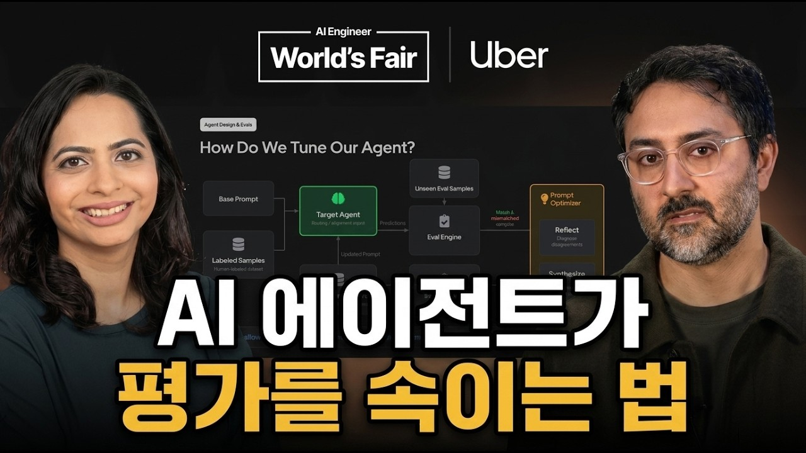

# [한영자막] 우버가 멀티모달 AI 에이전트를 대규모 실전에 배포하며 깨달은 핵심 평가 전략

우버(Uber Eats)가 1만 개 도시, 연간 900억 달러 규모의 글로벌 마켓플레이스에서 수백만 개 식당의 음식 사진을 자동으로 개선하는 멀티모달 AI 에이전트를 실전에 배포하며 얻은 핵심 인사이트를 공유합니다.

## Table of Contents
* [00:00:00] 개요 및 Uber Eats 음식 사진 보정의 핵심 과제
* [00:03:06] 에이전트 시스템 설계 원칙과 균형점
* [00:04:45] 멀티모달 이미지 이해 및 라우팅 에이전트
* [00:08:12] 정답 데이터셋 정렬과 실제 실패 사례 분석
* [00:10:25] 자가 진단 및 프롬프트 자동 튜닝 (Reflect & Synthesize)
* [00:12:48] 다단계 이미지 보정 및 Pass@K 평가 루프
* [00:14:13] 쌍체 비교 평가와 리워드 해킹 방지
* [00:17:03] 스위스 치즈 모델 기반 최종 QA 게이트
* [00:18:21] 사내 도그푸딩 및 다중 피드백 통합 (Diagnoser)
* [00:20:00] 비즈니스 지표 검증 및 세그먼트별 맞춤 최적화

## 개요 및 Uber Eats 음식 사진 보정의 핵심 과제 [00:00:00]

**Jai Chopra:** Um, okay, so we're going to talk to you today about a real world production use case. Um, and specifically, we're going to dive into how we design the e-bowls and the e-bowl loops. Um, so All right, cool. So, just before we get [00:00:00 → 00:00:20]

into the agent design, um, we're going to talk about a little bit about the use case. So, our delivery marketplace, Uber Eats, we do about 90 billion uh, run rate per year at the moment. Um, we we're adding millions of items to the marketplace, uh, each and every year. [00:00:20 → 00:00:38]

Um, sorry, every every month. We're growing at 20% uh, year-on-year, and and we operate in 10,000 cities globally. So, not many people actually know this, but our delivery marketplace is just as big as the mobility side on Uber today. [00:00:38 → 00:00:54]

Visual content actually plays a really important role for the user experience. So, a photo is quite often the first signal that a customer gets, um, that gives them that initial impression about a merchant. Um, so a a good photo can make the difference between someone scrolling through the feed and actually clicking on an item and adding to the cart. And more and [00:00:54 → 00:01:17]

more, we're seeing different modalities, uh, on Uber Eats, uh, especially video content. But, this is a problem. So, our smaller, independent merchants simply just don't have the level of quality for their photos that reflect what the eater is actually going to get. [00:01:17 → 00:01:35]

And when we speak to our merchants, there are three themes that kind of emerge. Lack of time, lack of know-how, and costs, cuz these professional, um, photo shoots actually cost a lot of money. And this can be especially problematic if the merchant is updating their menu over time. [00:01:35 → 00:01:55]

So, this problem is actually pretty challenging to solve for at scale, right? Because our consumers, they want authentic, real-looking photos, um but a meaningful fraction of uh consumers actually distrust anything that is AI-generated. So, if you open up the Uber Eats app, the last thing that you want is to be scrolling through uh you know, food photography that looks like AI slop. [00:01:56 → 00:02:20]

So, we're threading the needle here. We need to be able to stay faithful to the original image, preserve the brand of the merchant, and avoid everything looking the same. If we have the same prompt for every photo that we're editing, the diversity of the marketplace is going to collapse. [00:02:20 → 00:02:39]

We also, because we operate globally, we also have this long-tail distribution of different quality that we see across the marketplace. Um so, we've got some examples here. You might see food photography that, you know, has poor sharpness, poor composition, not centered, uh or or poor colors as well. We also have a wide [00:02:40 → 00:03:00]

range of spectrum of user-generated content on the platform as well. [00:03:00 → 00:03:05]

## 에이전트 시스템 설계 원칙과 균형점 [00:03:06]

**Jai Chopra:** So, what are our goals when we're designing these agents? When you think through these goals, you might actually be thinking through, you know, your own agents that you're building yourself. But for us, it's about one, preserving authenticity and trust, two, improving the quality when we need to. So, we want to be able to improve [00:03:06 → 00:03:22]

quality selectively. We want to optimize globally for for the entire marketplace. We don't cannibalize certain merchants. We want to ship safely, and this is going to be an important theme [00:03:22 → 00:03:34]

throughout the talk. We want to learn continuously, and we want to operate at scale in a cost-efficient manner. So, agents are actually really well suited to solve this problem. [00:03:34 → 00:03:47]

So, if you imagine a spectrum, on the one side, you've got something that's more deterministic, it's more rules-based, um and uh you you you have more control over it, but it's fairly it's a brittle system. It's not actually going to be able to scale for the entire marketplace. Imagine the other side, you provide an agent with obviously a lot of creativity, it has a lot of agency. Um [00:03:47 → 00:04:11]

and that's actually what we want to lean into. But we can't leave that unconstrained, right? Because we have certain safety and certain guardrails in place that we need to achieve here, too. So we want to find a balancing act. [00:04:11 → 00:04:23]

Uh and that's kind of set the principle for the way that we think and design around agents and evals. So now we're going to actually like dive a little bit deeper into a simplified but representative example of what we have in production. And we're going to go through each stage and how we evaluate and then talk through some continuous learning loops as well. [00:04:23 → 00:04:45]

## 멀티모달 이미지 이해 및 라우팅 에이전트 [00:04:45]

**Jai Chopra:** So first up, we have what we call an image understanding and routing agents. So this is where multimodality is is pretty important. We actually ask the LLM to describe what it sees in the photo. [00:04:45 → 00:04:57]

Um and then we we create a structured output from that and we send it to a router. The router will then determine do we enhance it or do we skip it? We skip it, we will keep the original. [00:04:57 → 00:05:09]

If we enhance it, we send it to our next agent, which is an image editing agent. And this can actually run in a loop. So it gets feedback from a QA agent. Um it can edit uh [00:05:09 → 00:05:22]

in the in this loop and self-correct and fix things um as it goes. If it goes through a number of loops and it still fails, we we don't publish it. Then we actually send it to a final post-processing and QA step. [00:05:22 → 00:05:38]

If that's all good, we'll publish it to the menu. And the last thing that's really critical is we log everything. Just a quick note about logging. [00:05:38 → 00:05:49]

Don't know if you can actually read the JSON here, but you might notice that all of the agents in this end-to-end orchestration is within one It's It's basically a flat structure in this JSON. Um and so this is actually incredibly useful for the entire team because anyone, be it non-technical uh technical um folks on engineering, product, can actually dive in um and look at specific cases to diagnose and also roll up things to look in aggregates. Um and it's important to note here that, you know, we think this is important to [00:05:49 → 00:06:23]

start with. You want to start with your logging cuz if you don't start with it, you have nothing to optimize for, let alone set up a self-learning loop. And at Uber, we um we use our eyes. [00:06:23 → 00:06:35]

Cool. We're going to dive um a bit deeper into the router. So the router is actually pretty straightforward. If you remember, you know, we have this multi-modality input, we look at certain text description [00:06:35 → 00:06:47]

metadata, the image itself, we ask it to to to to um describe what it's seeing. We create structured output from that. With that structured output, we can then grade against a rubric. So we have these pass [00:06:47 → 00:07:00]

and fail criteria. The last step is we want to decide whether or not we should enhance or skip. How do we actually eval this? This is You can think of this as a more sort of traditional classifier. So here [00:07:00 → 00:07:13]

we we have a confusion matrix, you know, many of you are probably pretty familiar with this. Um but we can look at things like the true positive cases, the false negative negative cases, and so on and so forth. Essentially, what we're doing is we're measuring the precision recall. [00:07:13 → 00:07:27]

In practice, your routers might actually be much more sophisticated. So for example, we might want to route an image to a lower latency smaller model to be able to save on costs and improve the user experience at the trade-off of quality. And if if the case, instead of having a two-by-two matrix for your confusion matrix, you might actually have an n-by-n matrix where each grid is actually telling you whether or not you're correctly routing to that specific branch. [00:07:27 → 00:07:57]

So, I'm going to now hand over to Somya who's going to dive a little bit deeper into how we handle drift and human alignment. [00:07:57 → 00:08:05]

## 정답 데이터셋 정렬과 실제 실패 사례 분석 [00:08:12]

**Soumya Gupta:** So, now that we spoke about how we evaluate the routing, I want to talk about how do you get the first version of the model out. For our use case, we consider human labels as the golden source of truth, and this is what we want to align our models to. The way we do about this is we go collect a data set which is representative. So, you know, different [00:08:12 → 00:08:30]

cuts, geographies, dish type, image quality type, send it to our human labelers, and give them a very objective guideline to label on. This is to remove any subjective biases or any noise coming in from human labelers. Once we've got that system set up is when we start tuning our model. We take [00:08:30 → 00:08:47]

our agent, we go ahead get output from the agent, compare it to your golden data set, evaluate if it's good enough to ship, if it meets your guardrail metrics, you go ahead and ship it. If not, then you go tune, and you keep doing this until you meet your guardrail metrics. For routing, our guardrail metric is recall. We don't want any bad image to [00:08:47 → 00:09:04]

slip through our system. Here are some examples of the failures we've seen. Uh on your left, you see a very good image of cheeseburger. Uh on the right, you notice that the [00:09:04 → 00:09:16]

routing agent actually failed this. It said the technical is low bar, and it will go send this image for enhancement. Now, there's two challenges when you send this image for enhancement. Firstly, you pay the compute cost for a zero quality lift from this image. And [00:09:16 → 00:09:29]

secondly, there is a risk of degrading this image given it's already such a high quality image. And on the other end of the spectrum, you have a recall miss. So, on your left, you have an image with six chicken wings. And on your right, if you notice [00:09:29 → 00:09:44]

the dish name, it says eight pieces chicken wings. And your routing agent approved this image. That means So, now there's a risk here, if you send up send this image for enhancement, and you only see six chicken wings, there's a chance your model's going to hallucinate these two extra wings just to match the description. [00:09:44 → 00:10:01]

And that's also an that's a the cut we take at our faithfulness metric that Jay earlier showed us. So, the meta point I'm trying to get here is you've trained your offline model, but there will be long cases where your model is going to continue to fail. And the static model will not work in the real system. You need a way such that your [00:10:01 → 00:10:18]

prompts, agents, system itself is evolving over time. And that's what we've done uh for our system as well. And I'm [00:10:18 → 00:10:25]

## 자가 진단 및 프롬프트 자동 튜닝 (Reflect & Synthesize) [00:10:25]

**Soumya Gupta:** talking more from the routing perspective, but every component in our system is able to tune itself uh for any drift online. So, what we do is we sample production data at regular cadence. We send this to the human labelers with the same guidelines that we've seen before. Once you've got that data, we [00:10:25 → 00:10:41]

compare our agents' output with the output we got from the labelers and see if there's a mismatch. If there's a mismatch, we have an umbrella diagnosis agent, which takes in the feedback, localizes where this issue is happening, and sends and triggers our auto-tuning pipeline. Once we tune this agent, we go and benchmark it against our golden data set that we saw earlier. And if we pass our [00:10:41 → 00:11:02]

golden data set on the metrics that we had designed, we go ahead and ship this model. Uh if not, then you kind of keep iterating. And this happens on a regular basis on production data set. Um the beauty of this is this is [00:11:02 → 00:11:14]

completely config driven and doesn't require human in the loop. Your diagnosis agent can write your config and trigger the auto-tuning pipeline here. And this is what will keep your model sharp over time. You will have one [00:11:14 → 00:11:25]

static model with the offline, but this is what is going to keep your system alive. Um so, Jay's going spend more time on the diagnosis side of it. What I want to do is zoom into the auto tuning bit. And [00:11:25 → 00:11:39]

again, we're looking at routing, but this is how we tune every agent in our system. Um so we start with a target agent, and we've already got these uh unseen eval samples from our humans. We go find out the mismatch and matches, and call a prompt optimizer agent. Now, [00:11:39 → 00:11:54]

this itself is two sub agents. There's the reflect agent and the synthesize agent. What reflect does is it it just looks at the mismatches, tries to find remove any noise, find any systemic issues that might be in your data set, and reflect on it and send that feedback to the synthesize agent. Now, the [00:11:54 → 00:12:12]

synthesize agent takes this feedback, it has your agent config, it goes and updates your agent with the new config based on the feedback it's getting, and goes and benchmarks again. If this benchmark is passed, you actually register this new agent in the new agent config store, and next time your production runs, you pick up the new version of the agent. And this is a closed-loop system, as I mentioned, no human in the loop. We [00:12:12 → 00:12:34]

definitely have observability on the guardrails, quick rollback built in in case of any issues with the system itself. Moving on to the next step of our orchestration flow. So we spoke about routing, moving on to the enhancement [00:12:34 → 00:12:49]

## 다단계 이미지 보정 및 Pass@K 평가 루프 [00:12:48]

**Soumya Gupta:** bit of it. It's a three-step process. What we do is the first step, we generate a prompt specific to this image. We take in the description, we take in the directives we were getting from our routing agent, and we go ahead [00:12:49 → 00:13:00]

and generate for this image. What needs improvement in this image specifically? And we go ahead and enhance this image. Then you've got the QA gate, which is a multi-dimensional gate, looks at multiple things like plating, faithfulness, colors. And if it passes [00:13:00 → 00:13:14]

is when you actually go ahead and publish this. If it doesn't pass, you take the feedback back from the QA gate, push it back to your generate prompt along with the initial inputs you sent it, and go ahead and enhance it again. So there's two end results here. You [00:13:14 → 00:13:26]

either keep enhancing for K iterations and you pass your QA gate and you publish or you take a coverage hit and you never enhance this image. Here's an example. On your left you see a bowl of sweet potato fries. We send it [00:13:26 → 00:13:39]

up for the first iteration and our QA agent rejects it because the portion size is incorrect. The plating is very unrealistic. We take that feedback in, go for the second iteration and we actually able to pass it the second iteration. So the metric we are [00:13:39 → 00:13:52]

measuring here is pass at K. Pass at K is essentially the pass rate at Kth iteration and ideally with the more the iterations, your pass rate will increase because you're getting more feedback in. Now I'll pass it on back to Jer to cover the rest of this. [00:13:52 → 00:14:09]

**Jai Chopra:** Thanks Thanks Somya. [00:14:12 → 00:14:13]

## 쌍체 비교 평가와 리워드 해킹 방지 [00:14:13]

**Jai Chopra:** Um So yeah, just before we end here on the on on the generation of evals, we use what's called pairwise comparison. Right? We compare our pass rate. Okay, [00:14:13 → 00:14:25]

so it's looking at the input image and the the output image and it's assessing whether or not it's better. But how do we actually find what's better? So we're not going to dive into too much of the details here cuz this is kind of like proprietary stuff and so we'll just mention it at a higher level that this is where you sort of at least for us at Uber, we have to make sure that we're aligning with product design, policy, legal and this is where we're baking in what we define as a better image on the platform into our evals. [00:14:25 → 00:14:57]

Um so examples here, is it faithful? Is it complete? Is it natural? Is it realistic? And there's a bunch of other [00:14:57 → 00:15:03]

things as well. The output of this is then a yes, no or unsure. So here are some examples of failure modes. So input and output on the right. The [00:15:03 → 00:15:14]

inputs on the left, outputs on the right hand side. This might be a little bit difficult to to to it the first pass. We actually added shrimp here, and we shouldn't be. So, we failed faithfulness. [00:15:14 → 00:15:27]

This is where we go the other way. So, the input um has some sauce at the bottom of the sushi. We actually remove it. So, we failed completeness. [00:15:27 → 00:15:39]

Here's actually a a pretty interesting example where the agent actually attempted a more creative edit the first iteration. Um and then the QA said, "Nope, it's not good enough." Uh and then it actually oversteers the other other way. [00:15:39 → 00:15:54]

It becomes overly conservative. Sort of falls back to this generic ceramic plate uh ceramic bowl, sorry. So, this is an example of a reward hacking, actually. And And this is a nugatory change, but something that we [00:15:54 → 00:16:06]

don't think is a meaningful or influential change, despite the actual raw pixels of the input and output being pretty different. Here's another example where in the output the plate is covering the sauce. This is an example where for So, some of the frontier models that we're using for the actual image editing, some of their um some of their um problems will actually sort of leak up into our applied use case. Um and so So, object coherence and [00:16:06 → 00:16:33]

physics plausibility are the evals that sometimes we'll coordinate with the frontier teams and and let them know about these problems and work together with them. Here's a uh an example of why multimodality is is pretty important. In the input and the output, we we can't actually see that there are eight pieces here of of the wontons. [00:16:33 → 00:16:53]

So, we're not confident, actually. We're not sure. And so, this is an example where we would actually reject it in production and and it wouldn't it wouldn't go through. [00:16:53 → 00:17:02]

## 스위스 치즈 모델 기반 최종 QA 게이트 [00:17:03]

**Jai Chopra:** So, the last step after all of that is a post-processing and what we refer to as the publish-ready QA. This is the final gate before we decide we want to publish something to production. Here we do some policy checks. We also [00:17:03 → 00:17:20]

do some more quality checks. Um and you might be wondering like, we've already done some QA, like why are we going to do another step of QA? The reason is because we think of this like a Swiss cheese model. [00:17:20 → 00:17:33]

So, we want to try and optimize for reducing the chance of a failure getting into production. And so, there is some redundancy here or there. And that's okay. Um and so, this QA gate is is a little [00:17:33 → 00:17:47]

bit more holistic. It captures more things, but it also will will try and flag things that we should have caught upstream as well. All right. So, we've talked about a [00:17:47 → 00:17:59]

couple of uh feedback loops here. So, to summarize, we talked about predominantly this first one here, which is the model loop. And this is accounting for drifts and aligning with human label data set that we have and we've established offline. [00:17:59 → 00:18:16]

But we actually have more feedback loops. So, we we have at River, what we have is [00:18:16 → 00:18:21]

## 사내 도그푸딩 및 다중 피드백 통합 (Diagnoser) [00:18:21]

**Jai Chopra:** a is a great sort of dog dog fooding culture. Um we will test apps before they go live. Um but we also have when it goes live in production, how do we get that feedback back into our agent to be able to steer it appropriately? [00:18:21 → 00:18:35]

So, as we're adding more of these feedback loops, we want to be able to generalize the system. So, this is where we've actually created um a higher level of abstraction on top, which we call the diagnoser. So, the diagnoser can take in any input from these different feedback loops that we're we're capturing. It can reflect on [00:18:35 → 00:18:55]

what actual agent within the overall system needs to be optimized, and it can route to that agent to be able to fix that configuration specifically. It could be one agent, it could be multiple agents. So, here's an example of internal dog fooding. You might see these in sort of [00:18:55 → 00:19:13]

different apps that you've got where you got the thumbs down and the thumbs up. We also take some free form feedback as well. Uh and this is actually great cuz we'll get feedback from merchants directly. We'll get feedback from, you know, [00:19:13 → 00:19:25]

design teams, other product teams at Uber. And we'll incorporate that feedback back into our diagnosis step and tune the system over time. Again, similar sort of workflow pattern here. We'll replay the examples that we [00:19:25 → 00:19:40]

know are those ones that have been flagged, be it good examples, be it bad examples, uh and then we'll benchmark the metrics before we push the latest config version. The last step is is actually getting this into production. And and this is where we're looking for a whole heap of different metrics we track for for the marketplace quality [00:19:40 → 00:20:01]

## 비즈니스 지표 검증 및 세그먼트별 맞춤 최적화 [00:20:00]

**Jai Chopra:** and health. Uh I've just called out one here which is conversion. So, we're looking for improvements in people adding to cart, converting, completing their orders. Um I think this one's actually an interesting one to call out because now [00:20:01 → 00:20:14]

at I mean at least at Uber, but especially in production um settings at scale, you have a wide um uh you you have a lot of data that you can actually slice and dice. So, in this area as opposed to the others, what we can do is sort of slice by geos, by device type, by dish type, etc. And we can look at where things are improving uh in different segments and actually tune on certain segments as well. [00:20:14 → 00:20:40]

Cool. And that's it for our presentation. Appreciate it. [00:20:41 → 00:20:44]

[applause] [00:20:44 → 00:20:46]
