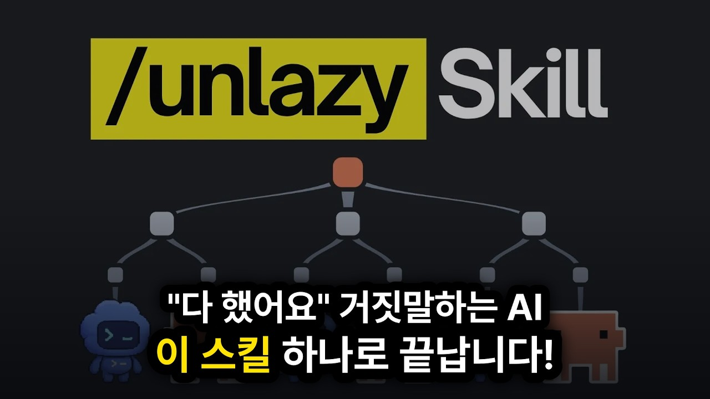

# [한영자막] GitHub 1위 개발자가 만든 새로운 Claude 스킬이 대단한 이유입니다

GitHub 트렌딩 1위 개발자가 공개한 새로운 Claude 스킬 'Unlazy'를 소개합니다. 작업을 맡기면 쉬운 것만 하고 다 했다고 거짓말하는 AI 에이전트의 고질적인 '게으름' 문제를 트리 구조와 엄격한 게이트 검증 시스템으로 완벽히 해결하는 방법과 실전 병렬 처리 팁을 정리했습니다.

## Table of Contents
* [00:00:00] 인트로: AI 에이전트의 게으름 문제
* [00:00:48] Unlazy 스킬이란?
* [00:01:47] 에이전트가 게을러지는 이유
* [00:04:24] 트리 구조와 게이트 검증 시스템
* [00:08:06] Unlazy 스킬 설치 및 설정
* [00:09:25] 속도 한계를 극복하는 병렬 처리 수정법

## 인트로: AI 에이전트의 게으름 문제 [00:00:00]

**Tech Bridge:** There's a fundamental problem with AI models. Whenever you give them tasks, they never take ownership of that task. And this is why we always have to review the agents output because we cannot trust it. [00:00:00 → 00:00:12]

But this laziness problem just got solved. So, GitHub's number one trending author has a solution for this. And this is the person who also made the design taste skill, which is one of the most popular design skills out right now. [00:00:10 → 00:00:24]

He has built a new skill called unlazy that solves this exact problem in AI agents. The workflow behind Unlazy is really creative, but after running it ourselves, we came across a huge problem with how slow it was and we found a way to fix that as well. Now, if you're new here, then welcome. [00:00:22 → 00:00:39]

We're a software company and this is AI Labs. In this video, we're going over what Unlazy is, how it actually works, the problem it has, and the change we made to fix it. [00:00:38 → 00:00:48]

## Unlazy 스킬이란? [00:00:48]

**Tech Bridge:** Now, laziness is a problem that basically shows up no matter which model you're using. Even the most powerful ones like Opus and GPT 5.6. It just becomes easier to notice in the smaller models because they have far fewer capabilities and their limitations become obvious much faster and unlazy is built to fix exactly that. [00:00:48 → 00:01:07]

This skill forces the agent to stop being lazy with its in-built mechanism and deliver what you actually need. And the main idea behind it is that it doesn't tell you the agent is done. It proves it. [00:01:04 → 00:01:17]

It checks the work against a ledger which is basically a checklist where every item has to have proof that it's actually done. So instead of just telling you the work is complete, it shows you the proof for every part of it. And it works with all the popular agents like Claude Code, Codeex and more. [00:01:15 → 00:01:33]

But to understand why this skill matters, you need to know what happens without it and how adding this one solves that problem. But before we go deeper into it, it would be great if you subscribe to the channel and hit the hype button. This small gesture of support goes a long way for us. [00:01:31 → 00:01:46]

[snorts] [00:01:44]

## 에이전트가 게을러지는 이유 [00:01:47]

**Tech Bridge:** Now before actually exploring the skill, we need to understand why the agents get lazy in the first place. Now, on a fresh context window, you might not notice that at all. There's barely anything in there yet, which is why the model can focus way better on the task you gave it, but it will be more visible as the context fills up. [00:01:46 → 00:02:03]

Now, these models don't have any in-built memory, so they actually don't know what happened in the previous message you sent. So, how does it know what happened before? These agents send all of the previous messages along with your new prompt. [00:02:02 → 00:02:14]

So, the model knows what has already happened. But as you send more and more messages, that pile keeps growing and there's a lot more for the model to pay attention to at one time. And this is exactly why the agents aren't able to focus as clearly on each part of the task and just slack off while they're working through it. [00:02:13 → 00:02:31]

And this laziness happens in two different ways. The first is that the agent tells you it's done when it isn't. There's been many times when you ask Claude Code to work through many files, it just opens a few instead of actually looking at all of them and reports that it went through everything. [00:02:29 → 00:02:43]

And that's the part that actually costs you. A model that stops early with clearly unfinished work is acceptable. But when it stops early and tells you it finished everything, that's where it becomes a problem. [00:02:43 → 00:02:54]

You don't actually know if it's completed until you verify it yourself. So if you don't and you build more on top of that unfinished work, you're going to run into problems in the long run. And the second is that it shrinks the job without telling you. [00:02:52 → 00:03:05]

So for example, you ask for something that has five parts to it. And one of those parts is difficult. It builds the four easy ones and skips the hard one. [00:03:05 → 00:03:12]

And the summary you get at the end never mentions anything's missing. Now, you might be thinking this isn't a new problem, and you'd be right, because these problems have always been there with these agents, and people have been building fixes for them for a long time. You probably already know about the Ralph loop. [00:03:12 → 00:03:29]

That one keeps sending the agent back the same prompt again and again until an indicator in its output says the task is done. And there's also Claude's goal command, which uses another model as a judge. And we've built loops like this ourselves, too, where a task list held the checks that every task had to pass. [00:03:27 → 00:03:44]

But all of these have a limit to them. With Ralph, that finish line is just a bit of text the agent writes while it's working. But a lot of tasks can't be judged by a finish line. [00:03:42 → 00:03:54]

There's no single word that tells you a feature is actually built properly. And the goal command uses a smaller model that reads through the conversation to decide whether the work is finished. So it's judging by what the conversation says instead of the work itself. [00:03:52 → 00:04:08]

and it can drift from what you actually needed. And with our own loops, those checks were real, but it was the agent itself that graded them. So, it was still the agent deciding whether it was done. [00:04:06 → 00:04:17]

And they can all work really well when your context window is fresh. But once you're deep into real work, they start to falter. And that's exactly the point where you need them to hold. [00:04:15 → 00:04:24]

## 트리 구조와 게이트 검증 시스템 [00:04:24]

**Tech Bridge:** Now, before we show you how to set this up, let's look at what's actually going on underneath and how that solves the problem. So, when you give this skill a large task, it doesn't start working on it. It breaks that task into smaller tasks first and then it takes each one of those and breaks it into smaller tasks again. [00:04:24 → 00:04:41]

So the whole thing branches out one task turning into a few and each of those turning into a few more. And that's why it's called a tree. And once it stops splitting every small task at the end gets handed off to its own sub agent and you're the one who controls how many times that happens. [00:04:39 → 00:04:55]

So when you write your prompt you say you want to use the skill and you give it a number along with it. That number is the depth of the tree. So if you say five, the task gets broken down five times over and no further. [00:04:53 → 00:05:07]

And if you don't give it a number at all, it picks the smallest one that fits what you asked for. Now, the reason it does any of this goes straight back to that attention problem we just mentioned. When the work is broken up like this, each task has one clear goal, and the agent working on it isn't carrying the rest of the job around with it. [00:05:05 → 00:05:23]

But those tasks can't be too small either. The rule the skill gives is that each one should be worth at least 10 minutes of real work because it has to be a proper piece of the job that an agent can pick up and finish on its own. So if you set that number too high and the tasks come out smaller than the 10 minutes of work, the skill lowers the split task to the default number which is three. [00:05:21 → 00:05:43]

And that number also decides how the work runs. Three or under is what the skill calls solo mode. And that's the default. [00:05:41 → 00:05:50]

Everything stays in one session and the same agent works through all of it. But four and up switches it into orchestrated mode and that's where it writes a lot more of it down. It writes a plan file that holds the whole breakdown and then a separate checklist for every single task in it. [00:05:48 → 00:06:05]

And the reason it writes that down in a file comes from how the previous version of this skill failed. That one tried to fix laziness by telling the agent to be thorough. But an instruction is the first thing to get lost in a long session which is the exact problem it was trying to fix. [00:06:05 → 00:06:20]

So this version stopped asking and started putting it in a file before any work begins. That file is the gates file and it's the ledger we mentioned at the start. And every item in that file is called a gate. [00:06:18 → 00:06:30]

So each gate is a checkbox with an outcome written next to it which is one thing that has to be true before the task counts as done. And underneath that outcome there are three lines. The first is the command that proves that outcome has been achieved. [00:06:28 → 00:06:44]

The second is the exact words that command has to give back. And the third is the evidence which starts out just saying pending. Then the skill comes with a checker and when you run it, it goes down that file and runs every one of those commands itself. [00:06:42 → 00:06:57]

If the answer that comes back has the words the gate was expecting, it ticks the box and it replaces that pending line with the bit of the answer that decided it. And that evidence line is what closes the hole in every fix we listed earlier. A ticked box with pending still under it. [00:06:55 → 00:07:11]

It means the agent ticked that box itself, which is just the agent telling you it's done all over again. So it counts as unmet and the skill treats that as worse than an empty box because an empty box is at least honest about where the work actually got to. And that same rule is what keeps the bigger runs honest. [00:07:09 → 00:07:27]

In orchestrated mode, it hands one task to a fresh agent which only gets the plan and its own gates file. Nothing about the rest of the job. But when that agent comes back saying it's finished, the main one doesn't take its word for it and runs that tasks checks again itself. [00:07:25 → 00:07:41]

And only then does it write a line into the plan file and hand out the next task. And there's an honest way out because sometimes a task turns out to be impossible. So instead of the agent dropping it and saying nothing, it writes a line giving up on that gate by name with the reason and that goes into the report you get at the end. [00:07:41 → 00:07:58]

So unlazy is a whole system rather than a single check at the end. And at no point in it does the agent get to decide whether the work is done. [00:07:56 → 00:08:06]

## Unlazy 스킬 설치 및 설정 [00:08:06]

**Tech Bridge:** Now to actually use the skill, you need to install it first. So you go to their official GitHub page and look for the install section and that's where you copy the command from. You can get the link from the description below. [00:08:04 → 00:08:16]

[snorts] [00:08:04]

After that, you open the terminal inside the project you're working on and run it. And once you run it, the installer starts and the first thing it asks is which agent you're using. If you're on Codeex, you don't need to change anything there because it installs into the agents folder that Codeex already reads from. [00:08:14 → 00:08:32]

But if you're on cloud code, you select it from the menu that opens and you can pick as many of the others as you want at the same time. Then it asks you to choose the scope, which is basically whether this skill should only work inside the project you're in right now or whether you want it available in everything you build. We went with the project scope because we wanted to test it against one specific project first. [00:08:32 → 00:08:52]

After that, you go with the recommended options and that's the install done. So when you open that project in VS Code, you'll see two new folders, one called aents and one called.claude, and they're not two separate copies of it. The skill itself actually lives in the aagents folder. [00:08:52 → 00:09:09]

and theclaw one is just a shortcut to it so that Claude code can also recognize it and use it without having duplicates in the same project. Now inside that folder, the skill file is the one holding all the guidance for the agent on how to use this. And once that's done, the skill is installed and you're ready to start using it. [00:09:07 → 00:09:25]

## 속도 한계를 극복하는 병렬 처리 수정법 [00:09:25]

**Tech Bridge:** But before you do, there's one thing you need to know. If you run this skill exactly as it is, it takes a really long time to get anything meaningful built. We found that out testing it on an app. [00:09:24 → 00:09:36]

[snorts] [00:09:25]

That session ran for around 3 to 4 hours straight and when we checked the progress there was just a login page and nothing else. Since we went through the skill we found that the problem was in its instructions. Both claude code and codeex can run several agents at the same time and each sub agent can work in parallel on a different task. [00:09:34 → 00:09:52]

But this skill hands out one task waits for it to complete and only then hands out the next one. So even though it was running agents, it was not using these agents capabilities to full extent. And that's where all those hours went. [00:09:51 → 00:10:04]

So, we open the project back up and change the skill itself. And you can pause here and copy the prompt we used if you want to change it yourself. What it does is get the skill to actually use the fact that these tools can run several agents at once. [00:10:02 → 00:10:18]

Then to run it, you type the skill name, then the depth of the tree, and then you write out everything you want built. Since we were building this demo app from scratch, we went with five. But you pick that number based on the size of your own task. [00:10:15 → 00:10:29]

If you want to work on a feature rather than a whole app in one go, two or three would be enough for you. And you don't have to worry about selecting the wrong option because if you picked higher than needed, it will automatically lower the depth for you. And the first thing it does before it builds anything is writing the plan.m MD file and then the gates.m MD file. [00:10:27 → 00:10:45]

In the plan.mmd, it also mentions which task is to work with which file so that if two agents are working at the same time, they don't overwrite each other's work. Then it lays the foundation and starts handing the work out to the agents all running at the same time. And with those fixes in, 10 agents were working at once. [00:10:43 → 00:11:03]

each on different parts of it. That run went for nearly two hours. At the end, we got the first version of our demo app running with all the features working exactly as we wanted. [00:11:01 → 00:11:12]

And if you're building at this kind of scale, you can also pair this with a model router skill. That's basically one that sends each task to the right model for it. So, the simple mechanical work goes to a cheaper model and the hard parts go to the strong one so that it doesn't hit your limit soon. Now this skill we used here was built through multiple rounds of testing and refining. [00:11:11 → 00:11:32]
